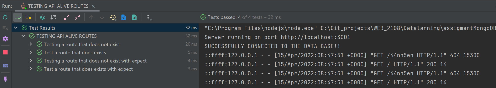

### April 2022
# Datalagring 
## Projektuppgift *Ursula Vallejo Janne*
### Content Innehåller:

- [1. General Projektplan](#1-general-projektplan-)
- [2. UX](#2-ux-)
    - [A. Prototyp](#a-prototyp)
    - [B. Font](#b-font-)
    - [C. ColorSchema](#c-colorschema)
- [3. Projektgenomförande](#3-projektgenomfrande-)
    - [ Funcionen i projekten ](#funcionen-i-projekten)
    - [ Tester](#tester)
    - [ Nya koncept ](#nya-koncept)
    - [ Svårigheter ](#svrigheter)
    - [ Konklusionen](#konklusionen)


# 1. General Projektplan :

I Datalagring projektet består av flera delar, generera en backend med koppling med MONGO_DB och därifrån utveckla innehållet i en version av TODO i REACT.

En del av projektet är att ha en projektutvecklingsplan vars beståndsdelar är nedbrutna i Trello.

Du kan se mitt projektplan i länken nedan:

[Trello Webbsida ](https://trello.com/invite/b/M7UjVzOj/fb20311872839905b792a56b94906268/datalagringmongodb-rest)

Varje fil har en README där du kan se de olika paketen som installerades. Här är en sammanfattning:

## Installera följande npm paket i min projekt:

```shell
BACKEND:
   npm init --y
   npm install 
   npm install cors express dotenv
   npm install -D nodemon
   Middlewares:
   npm install helmet morgan
   Tests:
   npm install -D mocha chai chai-http
   
FRONTEND:
   npm install react-icons
   npm install axios
   npm install tachyons@4.12.0
   
```

# 2. UX :

Den initiala tanken var att kunna följa samma projekt idé som jag utvecklade i det tidigare "TodoList"-projektet där det fanns en hemsida och en användare. 
Till slut bestämde jag mig för att inte göra det eftersom jag hade många svårigheter att implementera frontend eftersom det skiljer sig mycket från vad vi har implementerat tidigare. 
Av denna anledning valde jag att endast göra en enkel versionen där endast en sida visas som skulle ha motsvarat vad användaren skulle se i sin profil.
Vilket är följande:


För animation i rubriken, använd resurser från CodePen.

-För rubriktiteln ta:
- [Codepen: Text animation](https://codepen.io/yoannhel/pen/DMzjog)


## A. Prototyp:

Utvecklingen av Wireframes för projektet utvecklades i Low Fidelity, eftersom projektet inte är komplext, så valde jag att bara utveckla den här skissen.


Sedan skulle vara den enkla sidan som jag äntligen utvecklade men utan att navigera eller inkluderas i en användarprofil. 
En enkel version där du kan kontrollera kraven på vad som efterfrågades i projektet:


## B. Font :

För det här projektet valde jag att endast använda två typefaces så att det skulle bli visuellt rent och utan mycket visuell information. Jag valde ett mer geometriskt typsnitt för vad det har att göra med en att göra-lista som är mer automatisk (relaterat till organisationsscheman).

Typeface jag valde var följande:

1. Lato / Header
   
2. De förinställda typeface som finns på body som standard eftersom de har det tekniska utseendet som också fungerade i mitt projekt:
```shell

 font-family: -apple-system, BlinkMacSystemFont, 'Segoe UI', 'Roboto', 'Oxygen',
    'Ubuntu', 'Cantarell', 'Fira Sans', 'Droid Sans', 'Helvetica Neue',
    sans-serif;

```

Länkar:
- [Type-Scale](https://type-scale.com/)

## C. ColorSchema:

Grund färgs metoden är djupblå som är relaterad till visuellt lugn men jag valde att använda kontrasterande färger för att skapa en layout med en mer modern look, ung, för vilken kontrastfärger som rosa, smaragdgrön och vit används grund för fonts och informationen på sidan. 

Använd även färgen svart för texten i Todo.

##Final Color Palette:

Här färgskalan jag använde i projektet:


Eftersom jag valde att inte göra alla sidor i det ursprungliga förslaget så finns det färger som primära som inte implementerades men i designen följde jag parametern som färgpaletten hade fastställt.

# 3. Projektgenomförande :

Sedan berättar jag processen jag var tvungen att utveckla projektet.

## Funktionen i projekten:

Min enkla todo projektet består av endast en sida där funktionerna som finns i backend reflekteras. Dessa är:

- Alive :för att bekräfta om det finns en anslutning till API:et.
  I den nedre delen, lämna den tillgänglig via en ikon för detta leveransprojekt för att kunna verifiera att denna funktion har utförts. I en enda användarversion bör detta inte inkluderas.

### CRUD:

*GET:

- Get Todo Data: tar med sig informationen om befintlig data i arrayen.
- Get User Data by Name : Hitta en användare i arrayen, och returnerar hela objektet.
- Get all users:det finns i backend men använd det inte i frontend eftersom det bara ger namnen och inte användaruppgifterna.

*POST:

- Create Todo: ger möjlighet att skapa en ny användare och en uppgift som tilldelas honom.

*PUT:

- Update User Todo: ger möjlighet att modifiera en befintlig användare i arrayen, ge den ett annat namn och modifiera task.

*DELETE:

_ Delete User: Ta bort en användare med namnet som tar bort allt objekt i arrayen.

För att göra backend-delen följde jag Arasto-handledningen och modifierade den sedan med informationen vi hade i klassen. 
När jag skapade mapparna inom MongoDB följde jag Arasto-modellen, så min .env filen i backend skiljer sig från den som implementerats i klassen.

[Tutorial Arasto Node Mongo](https://www.youtube.com/watch?v=-rToCU-vQLM&list=PLo-BJUIALMg_twGJ5IjJIUpXqZH-ULmx0)

## Tester:

I projektet har både frontend och backend testats, vilket vi kan se nedan:

* Backend:

  I Backend-mappen hittar du Insomnia-testfilen.


Api test Insomnia:
  


Task test Insomnia:
  

Test backend:




* Frontend:

  


## Nya koncept:

I det här projektet var användningen av Docker och generering av en databas i MongoDB nytt för mig.

Idé att till exempel generera en taskModel som referens och hur man får en koppling till MongoDB är nya koncept som skiljer sig från det tidigare projektet.


## Svårigheter:

1.Den första svårigheten jag hittade var att kunna justera modellen som jag hade följt i Arasto-handledningen så att den skulle fungera med min frontend. 
Till exempel, i det tidigare projektet, gjordes delete- och uppdateringsfunktionen med namnet och inte med id. Jag trodde att det skulle vara enkelt att göra den förändringen, men i implementeringen var det inte lätt eftersom det var svårt för mig att förstå hur man anropar informationen från den externa databasen.

2.En annan svårighet som jag har haft och den som har tagit mig mer tid och ansträngning var svårigheten som jag stötte på när funktionerna gav det förväntade resultatet men de skrev inte ut meddelanden som att användaren inte hittades.
För att lösa detta i klassen hjälpte Lars mig att klargöra var informationen kommer ifrån och hur den kommer (vilken typ) för att kunna skriva ut den i min frontend, genom att förstå detta kunde jag förstå hur jag skulle slutföra lösningen.

3. När jag gjorde backend-testerna på task var jag tvungen att ange ett id-nummer varje gång, vilket inte kunde vara svårt vid utvärderingstillfället. I slutet av klassen har de erbjudit oss en idé som hjälpte till att lösa denna svårighet som jag hade när jag skapade en (let userId = '').


## Konklusionen

Övningen att kunna använda en extern databas var väldigt intressant eftersom de i projekt redan i arbetslivet oftast genomförs och jag tycker att det är ett bra verktyg åtminstone för att veta hur det kan genomföras.
Det verkade som en bra utgångspunkt för att förstå relationen med API:t, men jag tror att det hade varit intressant att se hur en mer komplex frontend implementering kunde göras.

Jag hade gärna haft en mer detaljerad förklaring av hur implementeringen gjordes korrekt i frontend-delen och hur den skiljde sig från vad vi implementerade förra gången. 
När man gjorde implementeringen den här gången var det många saker som inte fungerade ordentligt och kommunikationen mellan de olika delarna görs olika, varför jag gärna hade sett detta mer på djupet. 

Arastos tutorial hjälpte mycket i backend-delen men det hade varit intressant att se hur olika komponenter översätts till typscript.


