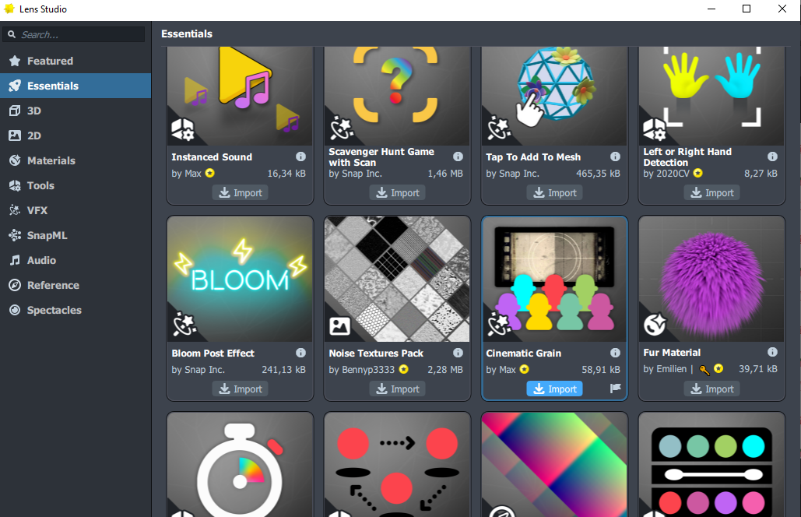
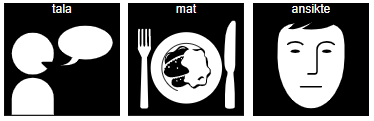
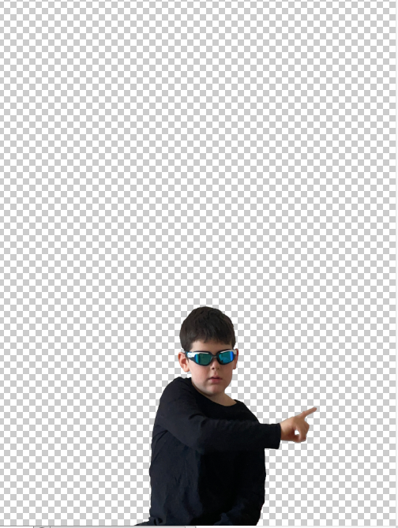

### December 2021
# Digital Skapande 1

## Project *Ursula Vallejo Janne*
### Content :

- [1. General Project](#1-general-project-)
- [2. Documentation](#2-documentation--)
    - [Step 1: HTML](#step-1-html)
    - [Step 2: Central Main image ](#step-2-central-main-image)
    - [Step 3: Text Head](#step-3-text-head)
    - [Step 4: Text and sound](#step-4-text-and-sound)
    - [Step 5: Seven narratives related with the story](#step-5-seven-narratives-related-with-the-story):
        - [1. Sensitive to sound ](#1-sensitive-to-sound)
        - [2. Sensitive to smell ](#2-sensitive-to-smell)
        - [3. Toys in order ](#3-toys-in-order)
        - [4. Problems texture food](#4-problems-texture-food)
        - [5. Communication ](#5-communication)
        - [6. Loving kid](#6-loving-kid)
        - [ 7. Different interest](#7-different-interest--math-dinosaurier-solar-system-natur-and-minecraft)
- [3.Uppgifter Info](#3-uppgifter-info)

# 1. General Project :

For develop the project I used the waterfall method for clear up the general idea and be able to develop a diagram for what will be included on the project and how I plan to develop it.

### Method for develop the project:

### Phase 1: Planning

On the first phase of the project have tried to do an analysis of what are the requirements for a digital project. The different options to develop a project using for example photos, videos, animation , sound or text for example.
On that stage I realized that was important for me to have first and  idea to work for, and after trying to find which method for production I should use to express myself.

As we don't have any parameters of what topic we should use as the main idea , and we can choose what  better suit for us to develop in the project, I decided to make it a little more personal. That way has and adds  value to me. I thought that I could try to make the effort to transmit something that is important and near for me, as is having your child diagnosed with Autism.

After I decided I would like to do the project based on my son I did a brainstorm of what topics can work with, what element's on his development were different compared with other kids, and how I can define him nowadays.

On a first stage after doing the brainstorm thought that would like to do a video to narrate and history based on my son's development, and what he has reached. Also try to transmit the idea to don't let anyone put boundaries to kids, as we all are in certain way different from each other, and these particularities most be seen as and different way to approach the reality, and  as power they have, that in certain way makes them stronger. I see my son proudly as a warrior or superhero that every day has taught me the truly important value of things in life and to never give up and to fight to be a better person.

As my plan was to do a narration with different aspects, my first approach was to think on a video, as is the most common used tool nowadays to describe what going on in our daily lives. For example: instagram, facebook and YouTube. And for been able to create a narrative my fist taught was the video as was the nearest. After the selection of the items that I would like to include in the project, I thought that  a tool as a webpage can also work for that purpose. Also adding value that at the moment im studying the course for web development and believed was more pertinent to try to express my idea of the narrative of my son through that media.

After the brainstorm I took 7 main ideas that could implement in my project as are some particularities with the kids with ASD( Autism spectrum disorder), related with the perception of the environment as: 
-sensitivity to the sound.
-sensitivity to strong smells.
-Problems with some textures with the food.

 And other behaviour or cognitive aspects as:
- Place their toys in order.
- Communication, as usually have delay at speaking need pictograms (images) in most of the cases.

Other aspects related with that how I perceive my son nowadays:
- As a loving boy.
- Have different interest and learn a lot of them as mathematics, dinosaurs, solar system, natur, fishing and Minecraft.

### Phase 2: Design

On the second stage of the project, once the idea of the project was clear and knew with aspects would like to work on it,  I started to try to create a diagram or a draft of how I would like to create a layout for the webpage that you can see below:

### Diagram projektet :

### Main concept for the  HTML page:

As the idea was to generate a narration around few aspects of my son, and him as a superhero, decide that I would like to use a layout where he is in the center of attention of the web page as a superhero, and surrounding him place the different narrations  that  are in loop, so anyone can read visually them in any stage.
To make sure that someone is able to understand what I would like to transmit, and  see the different relations with the images that are showed in the webpage. For that reason I decide to include  sound to the page with a narration, a story that I wrote using the perspective of a boy that narrates how was his development, and describes the power that his mom sees on him.

For the seven narratives of the aspects I select previously, decided that would like them to be dynamic; that the general project has some movement. That's why I decide that would use video and gif format for create them. Also try to include some playful relation with the childhood as they  learn concepts through playing ( drawings, puppets , toys).
For each narrative I tried to visualice the main concept, to figure out the approach that better suit for generate that content, and select an image that describe the idea. This will be explained ahead in the documentation, where I describe each of the seven narrations.

### Phase 3: Development

To be able to start with this phase it was needed  to have a draft of what would like to have on the webpage (layout) and the concept of the project.  I planned a time frame to  have time to create all the content need it. 
Each  visual content was based on the analysis that was done previously, on how express each of the seven narratives on the formats that I choose as video and gif. After these was ready I was able to start with the process of creation of the content for the general project.
At the same time that I was working on this process, tried to keep a record of the stages I followed in the creation, to be able to describe the digital creative process that was needed it for the course of  'Digital Skapande'.
The process I followed and the information on this developing process could be read more in detail on the documentation part, as each process is described there.

### Phase 4: Launch, testing

The deadline we had for the project count as the launch of product. Once that I ensamble all the pieces on the webpage was needed to control that they were actually working.  On this stage  also worked  in the last adjustments of the CSS to change the size och each narration and see that actually the composition of the web page have a good balance between the elements  and the same time give the feeling to be dynamic. 
Once this was double-checked and adjust, I was able to launch my project.

See the final project below:

[GIT Ursula Vallejo ](https://github.com/Ursulavallejo/WEB_2108/tree/main/Digital%20skapande_1#5-communication)

# 2. Documentation  :

On this part we can see all the process involved on the creation of the different elements that are included on the webpage.  Include also information regarding this main questions:

* What tools have you used and why?
* What do you portray with your work?
* How did the process of creating your production work?

### Different parts of the project:

## Step 1: HTML

The tools that was used in this step was Webstorm to be able to create a webpage that contain the general project. 
The aspects were taking in consideration were:

- Create a Layout :
In the head a Typography  with the title.
A main image in the center to call the attention of the eye , in this case will be the boy superhero.
Around main image the other narratives. Create  balance between them, as are 7 should be placed 2 on each side and 3 under.

- Have a sound that is the history of the boy. 

- A button where we open a drop menu, and we can read the story.

### About the process:

* What tools have you used and why?

To be able to configurate the webpage I used Webstorm to create the HTML and include the content I created to illustrate the narrative of the idea of my project. The type of formats used are video, gif, sound and image(.mov,.gif,.png and .mp4). 
- I used this format as was posible to show different narrations at the same time and make them perceive more dynamic for the person that has access to them (viewer). 

* What do you portray with your work?

  With this I want to transmit that many kids face a different development on his life, that  every kid is not the same and that those differences  can also be seen as strengths.  A boy that is a superhero for his mother, as he showed to her that those particulates,  are a power to approach the world in a different way and that sometimes people put limits of what others can learn, and they shouldn't do so. Fight for been a  better person and let the others have opportunities to evolve in life.

* How did the process of creating your production work?

- First work in creating the general layout of the project using only some image for configurate the position and the functions inside the web page.(HTML)
- Check the video play automatically and do a loop. The new version of Chrome only show videos that are muted so for been able to know this checked few forum as was not working for me.
- On the audio test that we can add it to the web and the format that work with it. In this step saw the need to transform the M4a format witch  the iphone's used by default  and convert it to a mp3;  the audio control do not handle the original format of the iphone's.
- create the CSS style for been able to place and organice the elements accordingly with the diagram of the idea that I did on the first phase. Using a Grid to place the elements on place.
- See that actually teh autoplay of the audio was disturbing me reason that make me see that is better that the user has the option to start it when interact with the page.
- create a Javascript script to be able to have a dropdown menu that opens and close where the text of the audio can be found.
- Once the final elements are ready was able to change the ones as used on the draft of the HTML for the final ones .
- Test that the web is working properly and lat adjustments on the place of the elements on the layout if the webpage.

See below the draft of the process:

## Step 2: Central Main image 

The original idea was to create and animation for the superhero.To be able to do so took several photos but after creating the draft of the HTML realice that visually was not necessary. All the other content involve movement and saw  that if the center image was still will work as an anchor for the rest of the images. The idea was that all the other histories were related to that one, reason I  decided that actually was better that the center superhero image stay still as work as an anchor for the other ones. 

### About the process:

* What tools have you used and why?

- For the production of this narration was needed a camera, hand-made costume and a photo-editor. 
  The first idea was to create a gif for that reason I shoot several pictures but afterwards decide was better to keep the main image still as an ankor for the rest of the histories on the web page.  As I would like to keep the idea to use homemade costume as a superhero,  emphasize the iconography of the comics ( stars coming from the background as wonder woman posters) and change the red color of the superhero cape. For that reason was needed it a photo editor. I decided to use Photoshop as im used to work with that  program and like the different type of brushes and edition option that we can implement. 
- The original photo was created with my son that is the main character. Tried different position until could  find an angle that shows  him with the arm extended and with a hand made costume (as they were playing in the house to make it more natural and close to everyone ).

The image of wonder woman were the idea of the stars was taken .

* What do you portray with your work? 

With the picture want to transmit that my son is a superhero for me.  Select to use a homemade costume with regular things we have at home, as is a daily home game and not posing for a scene. Taking a more natural context that anyone can see on his daily life   while kids are playing at home. On my daily life my son is my superhero.

* How did the process of creating your production work?

- First I used a camera to shoot a serie of photos as the original idea was to used them to create a gif. In total around 3 sets of around 80 photos were shot for that purpose.
- After the decision to maintain this main image still I overlook all the ones I had and select one to work on.
- The image was imported to Photoshop where I:
1. remove the background to have it transparent ( that way integrate better on the web page).
2. Balance the colors on the image.
3. Amplify the image to remove the white pixels on the contour of the image.
4. Duplicate the image and delete all content, except the area that I would like to change the color to red.
5. Have the idea to add a mask but actually decided to keep the original as he used swim glasses . Usually kids plays to dress that way to play so decided to keep it as is their own way to express.
6. After I draw some starts with a brush to try to make relation with the comic iconography of the superheros. For example the wonder woman.
7. Export the images as png to keep the transparent background.

Some images from the process:

## Step 3: Text Head

For the letters placed for the main tittle, the intention was to keep a relation with the idea of a superhero. This topic is mainly find in comic magazines, books. For that reason  I decide to use a Typography inspired on the superheros comics. Use a more specific typography and not a standar one that is part of an HTML preset.

### About the process:

* What tools have you used and why?

As I decide to use a specific typography. For that I search it on the internet. As I took some content was already made I need to use some image-editor to be able to transform it with the content I need it. For that purpose I used Photoshop to modify the typography.

* What do you portray with your work?

With that typography want to transmit a relation with the comic books, make it more specific and not a generic font-letter found in a library on the HTML. Want that the typography follows the main idea of the project and create a relation with the content has on the web page, for example the main photo of the superhero and the typography used on comic book with that topic.

* How did the process of creating your production work?

- On a first instance try to find some images on the web with different typographies that could work to transmit the idea of the comic books and the overall text of the title.
I found the following two images to work:

-I import them to photoshop:
For the Superhero image: Was needed it to retouch and remove elements on the image. After duplicate one letter and place it at the end to have the correct text that I need it. At the end place drawing filter to try to have the sense of more kids drawing  and not only a vektor drawing. And place it on a transparent background in format png.
For the Mamas text, delete the text was not need it. Duplicate the letter need it to create the title and place it on a transparent background. At the end distort the angle of the text to be more dynamic.

 You can see the  original above  and transformation below:

## Step 4: Text and sound

On the webpage the idea was to have a history narrated from the kid's perspective. This is included  to let user/viewer understand the whole project and been able to see the different relations that take place on the  narratives. The audio and text explain the connections that are inside the project. The audio and the text are the same.

The page include:
- Control for the sound below him.
- Button that open the text to be read (dropdown).

### About the process:

* What tools have you used and why?

For create and the audio and the text was needed it to use a Text editor as Word , a microphone, audio recorder device and an audio-editing tool (Audacity).
The text was worked in Word to be able to have a draft and be translated to swedish. Also use it on word worked to have already in a digital version to be copy and paste it on the HTML dropmenu of the project.
The history was record with a microphone on the iPhone and used it on Audacity to modify the acoustic and include some background sound to the history. 

* What do you portray with your work?

With the Audio and the text want the viewer to be able to understand why I see my son as a superhero. All the different aspect on his development and hear the story as he was telling it to them.  

* How did the process of creating your production work?

- First I focus to work in a history related  with the experience of the grown upp of my son as the following topics:  Particularities of the kids that have Autism. 
The reason why mom see him as a superhero. 
 After all the difficulties he is loving child that have a lot of interests and how have taught us as  parents at never give upp and don't let anyone  put boundaries for what he can do.
  For that I wrote the particularities he had when was lite and are common for autism and at the end was make him what he is know ... how he has evolved and identify him.
  Have select 7 different aspects to show in the history and each has a gif or video that reflectes it but all are part of the main history that is played with the narrative in the sound.
- The draft was written in spanish as is my mother language, and after I was happy with the narration the second step was to translated to swedish with help of my husband to keep the essence of the text.
- I record a first draft with the text in spanish to test how sound the audio with the iphone and see how can reduce some possible noise at the background.
- Did 3 different records of teh voice of my husband to see which one had better sound quality. At the end choose one.
- The audio track that I choose need to be transformed from m4a to and mp3 format. Reason I use an online converter to do it.
- Imported to Audacity (audio editor): 
  * Import the voice record to the editor program where I choose 3 different filters to minimize the acoustic of the room and any possible sound that can create disturbance.  The filters I used over the voice sound are: noise reduction, normalize, loudness normalization.
  * After import a background audio. I searched it in different webpages where are sound libraries and found one that worked to create the atmosphere that I wanted it on the story. ( happy and playful that is near the childhood).  For  the background, was needed it to divide the sound file to be able to create fade in and out of the sound and a duplicate the background on a second layer to be able to reduce the volume on that track for  been able to listen the story.
- After I exported as mp3 and included on the draft I have created on the HTML web page.

- 
- [Sound Library ](https://pixabay.com/es/music/search/genre/melod%C3%ADas%20para%20ni%C3%B1os%20felices/?mood=relajado)
  
### Text Narrative Spanish: (first Draft)

No hace mucho tiempo atrás, mi realidad era muy diferente.
A los 2 años fui diagnosticado con autismo.
¿Pero qué significa esto?
Muchas personas lo ven como una discapacidad, pero es una forma diferente de relacionarse con el mundo.

Cuando era pequeño me molestaba mucho ir de compras a tiendas de ropa, allí ponen música muy alta y me ponía muy nervioso.
En el bus, me afectaban los olores fuertes, como el de los perfumes. No los aguantaba, y me tocaba bajarme del bus y esperar al próximo.
A la hora de comer, me molestaban mucho las diferentes texturas de los alimentos, como el de las frutas y no lograba comerlas.
Hasta los 4 años, hablaba muy poco y me costaba mucho enfocar mi atención en alguien.
Al jugar, me gustaba mucho hacerlo solo y poner en orden repetitivo mis juguetes.
Estos son rasgos característicos de los niños con autismo, por si no lo sabías.
Ahora tengo 7 años y muchas de esas cosas las he ido dejando atrás. Bueno, aún no logro comer trozos de fruta; me da vueltas la cabeza al intentarlo. También me gusta que la gente siga las normas, o ¿para qué están hechas?

Mis padres me dicen que yo soy capaz de hacer lo que quiera, de aprender y ser una buena persona.
Que siempre intente primero como me siento al hacer las cosas que me interesan, antes de decir que no puedo. Y nunca creer a los que intentan ponerme barreras a lo que puedo llegar a hacer.

Para mi mamá soy su superhéroe, porque día a día se emociona al verme crecer y evolucionar. Al ver todos los intereses que tengo; de como me apasiono por un tema e indago hasta conocer muchos aspectos de él. A mí me gustan mucho las matemáticas, los dinosaurios, ir a pescar con mi papá y puedo identificar que pez ha picado. Actualmente me interesa mucho Minecraft y hablo mucho de todo lo que se puede construir allí.

Tengo un superpoder especial, el de dar mucho cariño, otro de poder contar todas esas cosas que me interesan y enseñarlas a mis amigos. Explicarlas en español a mamá y en sueco a papá.

Soy el superhéroe de mamá, y ella me enseña que nunca debo dejar de creer en mis superpoderes. Porque cada persona es única e importante.

 * First Audio Draft Spanish can be found on img folder: spanishHistory.mp3

### Text Narrative Swedish: 

För inte så länge sedan var min verklighet väldigt annorlunda.
Vid 2 års ålder fick jag diagnosen autism.
Men vad betyder det här?
Många ser det som en funktionsnedsättning, men det är ett annat sätt att relatera till världen.
När jag var liten var jag väldigt störd av att shoppa i klädbutiker, där de spelade väldigt hög musik och jag blev väldigt nervös.
På bussen drabbades jag av starka dofter, som parfymer. Jag stod inte ut med dem, och jag var tvungen att gå av bussen och vänta på nästa.
När det var dax att äta blev jag väldigt besvärad av matens olika texturer, såsom frukter, och kunde inte äta dem.
Tills jag var 4 år gammal pratade jag väldigt lite och hade svårt att fokusera min uppmärksamhet på någon.
När jag lekte gillade jag verkligen att göra det ensam och sätta mina leksaker i repetitiv ordning.
Dessa är karakteristiska drag hos barn med autism, om du inte visste det.
Jag är nu 7 år gammal och många av dessa saker har jag lämnat bakom mig.
Men jag kan fortfarande inte äta frukt.
Jag gillar också att folk följer reglerna, Det är väl därför som dom finns?
Mina föräldrar säger att jag är kapabel att göra vad jag vill, att lära mig och vara en bra person.
Jag försöker alltid tänka efter och prova att göra de saker som intresserar mig, innan jag säger att jag inte kan. Och jag tro aldrig på dem som försöker sätta hinder för vad jag kan göra.
För min mamma är jag hennes superhjälte, för varje dag ser hon mig växa och utvecklas, med alla mina intressen.
Hittar jag ett ämne som jag brinner för så forskar jag det tills jag vet så mycket som jag kan om det ämnet, och då får jag mer och mer krafter. Jag gillar verkligen matte, dinosaurier och att fiska med min pappa och jag kan identifiera alla fisk som jag har fiskat. För närvarande är jag mycket intresserad av Minecraft och jag pratar mycket om allt man kan göra och byggas där.
Jag har flera superkrafter: en som ger mycket kärlek, en annan för att kunna berätta alla de saker som intresserar mig och lära ut dem till mina vänner.   Och jag kan förklara dem på spanska till mamma och på svenska till pappa.
Jag är mammas superhjälte, och hon lär mig att jag aldrig ska sluta tro på mina superkrafter. Eftersom varje person är unik och viktig.

* Audio swedish can be found on img folder: berättelseWeb.mp3

## Step 5: Seven narratives related with the story

### 1. Sensitive to sound:

One of the characteristics of the kids with autism are that they are sensitive to sound. Usually they get overwhelmed as they get overstimulated in situations with load music or noise; reason they get upset and nervous . In many cases they touch their ears or used headphones that stop the sound.

### About the process:

* What tools have you used and why?

For this part of the story I used the app of instagram. There you can search for different filters and also choose between different format for create media ( video, loops, reels and also include specific audio or text).
See instagram as a tool were many people express what they are going through on their daily life. Influencers and companies get a lot of attention. They use the tools that instagram offer and help them to create different narratives depending on the purpose want to approach.  
I see part of the story that im telling on my projects as a diary, that we  can compare with the histories on instagram reason I decide to introduce on my project what a tools as instagram can offer to us in as digital narrative.
* Also used a video editor as ShotCut to remove the sound and be able to have other format as the gif . (Instagram create video as .mov)

* What do you portray with your work?

With this  video want to capture the moment where the kid of the story needed to put the hands on his ears to stop all the external impute ( lyric notes) that surround him. A reaction to the music that is not a pleasure to him on the contrary trigger discomfort to him.

* How did the process of creating your production work?

On a first instance did research of the different option that offer instagram to create media. The filters of virtual reality that can be found and how they work.
Found interesting that not necessary the content need to be published can be saved on your device. That way you can export it to other programs to edit them or place it in other context as I did in using it on my webpage project.
For my video decide to use a responsive filter as they track the movement of the person in front of teh camera, and it's modify with the interaction ( music notes that are generated with the movements of the face).
To capture the idea of the kid getting overwhelmed with the music notes, was needed it to shoot the video 5 times. The first time the light  of the room was darker  and in other occasions  the composition of the image was not creating the atmosphere that was looking for.
Once I got the shot as .mov format  I imported also to ShotCut video editor to delete the audio and create a gif.  On the web used the .mov and on the markdown the gif.

### 2. Sensitive to smell:

Kids on tne autistic spectrum are oversensitive on their senses. The most common  is being sensitive to smell. Usually parfym or other strong smells can cause that kids turn nervous and unconformable, reason why in many therapeutic places to can see posters that they are a parfym free zone.

### About the process:

* What tools have you used and why?

[Spark AR](https://sparkar.facebook.com/ar-studio/)

[SketchFab](https://sketchfab.com/)

  
* What do you portray with your work?
* How did the process of creating your production work?
* 
  

Digitala spridningsvägar
* Hur gick processen till med att skapa din produktion?
  (Beskriv så noga och utförligt som möjligt stegen som du har gått igenom)

### 3. Toys in order:

One of the characteristic of the kids with autism are that they have a different mindset  that can be identified where they play. Most of them like to place the toys in order, or do repetitive movement with the same element over and over again. My son when was lite love to place ir order all his cars and trains reason I choose to use the cars for this narration.

### About the process:
* What tools have you used and why?

For create this narrative on the project was used a camera, a lot of cars, tripod, shot remote-control, a program to edit photos as Gimp.

The idea was to generate a sequencer of cars that follow some order, to be able to create that felling, choose better to do a gif as on a video don't have the felling to be in different frames that's come one after the other, but a gift as is slower and get the sense that cut every images one after the other.   To have that effect on the narration was the reason decide that a gif worked better as the cars follow an order and are following each other by place them in the space.

* What do you portray with your work?

On this narrative what to capture the idea of order, that constantly keep the same pattern as the kid the with autism follow when they play.

* How did the process of creating your production work?

For create the gif was needed to took around 60-80 photos to create the felling that  the elements  follow some order and create a dynamic of movement with them.

For been able to have a gif that worked for me, was needed it to shoot the series of photos  3 times as the previous ones saw thinks that actually was not working to create the sense I want with them.

On the first try realized that I didn't like it the distribution of the lines of the cars on the space and how the size of the cars was showed, that the reason why I decided to do another shoot with a different composition. 

On the next shoot realize that the order that the object disappear on the sequence didn't feel like they were following one after the other reason I decide to change the order that they disappear on the screen, to have the same pattern as they were placed on first instance.

Once I had the sequencer of photos that worked for the project I used Gimp editor to  adjust the light of the photos and create a gif with the animation filter. At the end was exported making the frame interval lite slower as the one comes by default ( the ones  selected was 180 frames to be able to see the cars, the other was fast.)

### 4. Problems texture food:

Usually kids with some autistic disorder are sensitive to textures in the food,that makes sometimes really hard to have different options at the time to eat. In the case of my son specially is on the texture of the fruits, actually the only he likes is coconut all other if not are in a juice he doesn't eat them. In this narrative want to show hes disapproval at the moment to eat fruits.

### About the process:

* What tools have you used and why?

I choose to use a program of augmented reality as Lens Studio. This program is powered by Snapchat to be able to create different experiences with tracking technology, built-in features to create interactivity on the camera.
Along other new technologies I consider that the AR is changing our way to express over the social media. Also give companies a new landscape for advertisement and for 2d and 3d creators to express, or even a simple users can create their own filters with the built-in interfaces that can react with the voice, body movement of facial expressions. Can include sound, text and any animation.
Is a useful tools to create narrations , reason I choose to use it as for me seems really interest to understand and learn how this new AR technologies can be used.

  [Lens Studio](https://lensstudio.snapchat.com/)

* What do you portray with your work?

On this work want to show to the viewer the difficulty that my son has with certain food. In his case is specific to the textures of the fruits. We can see his reaction to an Apple with a negative movement of his head and also see fruits around him on the filter.

* How did the process of creating your production work?

- First need to download the Lens Studio to my computer and did an introductory tutorial to be able to understand how it works.
- Started creating a new project and selected the segmentation template to be able to change teh background of the filter.

Once selected was able to configure for example for what type of device want to create the interface, manipulate the texture to uses (background) as the one come by defect are with heard. Also, can be changed the light of the user will be showed on the pictures ( light filters) and the source of the light.

You need to select the object you want to track to activate the filter you are creating. To be responsive with it. As below:

YOu can also add different interaction inside the filter with a library of 3D ,2D. mesh, textures etc..   See below other options:

Over the project you can use different layes to manipulate teh light and the object you will take for the interactivity. Other layes can be added it for example in my case use one for the background and other for the fruits with transparent background that move around the figure.

For the background image try few that I found on internet with a png format. Can be also used jpg if you don't want to use any transparency.
Example of the image:

Import the image to the Lens studio as a texture to have it as a background and other on other layer to have movement.

With the preview you can see how actually the filter worked.

To be able to use the filter you have created need to pair the lens Studio with a QR Code and that way you can use it on your telephone app of snapChat.

### 5. Communication 

Usually the kids with autism has some delay speaking and some of them don't develop those skills properly. To help them to comunicate with the others is used a system based in images called pictograms that also is used in therapies to help them gain more knowledge of concepts to try to speak. 
I took the idea to use a puppet as I was a child sesame street teach the kids the concepts of numbers, vocabulary etc. Nowadays is also used in some psychological therapies to help tp catch the attention of the kids and be able to teach to them.
As my son used that system to help him to develop the speech and the communication is important for us as humans, took the idea of the puppet show to us the pictograms as he was speaking to the viewer.

### About the process:

* What tools have you used and why?

  For create this narrative for the project I used a camera, tripod, shot remote-control, and a program to edit photos as Gimp.
  The idea was to generate a gif with the puppet where he seems that talk to us showing a pictogram poster that is at the back.
  Use the gif for animate the puppet and the able to generate a narrative accordingly with the idea of the project where the communication was a key point. 
 The hand made puppet belows to a daily landscape on the kid's iconography as Sesame street do in their show.

* What do you portray with your work?

With this narrative what to transmit the idea of the importance that is to try to comunicate with the others. If is not possible with a speech can be possible by  showing pictograms. Communication is  a key to make understand our values, needs and affection to the others.

* How did the process of creating your production work?

For create the gif was needed to took around 80 photos to create the felling that  the puppet was communicating and move around showing to us the pictogram poster at the back.

For create the gif took 3 different set of images until got one that seems was working  with the sequence that I want to create.

On the first shoot were big gaps between the  image's for that reason the sequence was not having the felling to have flow between them (movement was cutting).

On the second shoot realized that the sequence created was too short and didn't get the felling the puppet was talking to us. Also realized that actually part of my arms was showed on the photos . The skin was making that the attention moved to other parts of the image reason I decided to take the set of photos again and cover my arms to avoid this disturbance and take more photos to capture the puppet moving on the screen.
See below gif of the second shoot:

At the end the shoot that I selected to work with it was the last one as correct the aspects that saw before.
Once I had the sequencer of photos that worked for the project I used Gimp editor to  adjust the light of the photos and create a gif with the animation filter.

See below gif of the third shoot:

 At the end saw that the gif was moving too fast on the html project in relation with the other histories reason I  decided to exported again but using more frames to make some delay between the images. The Gig was exported making the frame interval lite slower as the one comes by default 

See below gif of the final gif :

Some Sesame street puppet inspiration:

Create my own puppet ( handmade with a sock) :

### 6. Loving kid:

On this part of the project want to narrate that my son has accomplished to be able to express love surround him. Kids with autism have difficult to create relations with others but in the case of my son he is a really loving boy that cares os the people that surround him. What to transmit of that kindness / love he gives to the others in this video.

### About the process:

* What tools have you used and why?

For this part of the story I used the app of instagram. There you can search for different filters and also choose between different format for create media ( video, loops, reels and also include specific audio or text).
See instagram as a tool were many people express what they are going through on their daily life. Influencers and companies get a lot of attention. They use the tools that instagram offer and help them to create different narratives depending on the purpose want to approach.  
I see part of the story that im telling on my projects as a diary, that we  can compare with the histories on instagram reason I decide to introduce on my project what a tools as instagram can offer to us in as digital narrative.
- Also used a video editor as Shotcut to remove the sound and be able to have other format as the gif . (Instagram create video as .mov)

* What do you portray with your work?

Want to capture a moment that a kid is able to express love as he kisses his panda bear. An intimate moment with someone he loves.
Symbolises tender love that can be found on the kids.

* How did the process of creating your production work?

On a first instance did research of the different option that offer instagram to create media. The filters of virtual reality that can be found and how they work.
For this video decide to use a  background animation ( hearts in movement around the kid  and the teddy bear ).
To capture the idea of the kid hugging with love the panda needed to shoot the video 3 times to get the correct angle. As didn't want the face of the kids be the one calling the attention, what I want to emphasize was the action between the two of them. Show only part of the face, over the shoulder was a better option for this purpose.
Once I got the shot as .mov format  I imported also to Shotcut video editor to delete the audio and create a gif.  On the web used the .mov and on the markdown the gif.

### 7. Different interest : Math, dinosaurier, solar system, natur and Minecraft.

On this narration my idea was to capture the different interest my son has. He is at the center of the image, point it out to us with the finger the topic he liked.  When he likes something  he really focuses on a topic and  like  to acknowledge as more he can on that topic.

### About the process:

* What tools have you used and why?

  For create this narrative for the project I used a camera, tripod, shot remote-control, and a program to edit photos as Gimp.
  The idea was to generate a gif with my son showing to us the different interest he has. I have chosen to create a gif as the idea was to incorporate the images of the interest he has around him and thought to superimpose them on a photo edition program was the better alternative for my project, and also give me the possibility  to have the background transparent.

* What do you portray with your work?

On this narrative want the viewer to see the interest my son has and that he is capable to learn many things and that sometimes our concept of kids with autism's is biased with prejudices .

* How did the process of creating your production work?

- The first step on this process was to take pictures to be able to generate the png photos for the gif.  For this purpose I took 4 different series of sequences of the movement of the finger pointing to the wall.
- Once I had different options ,look at them in speed to see witch of them can work to create the surrounding movement.  After I selected 26 photos.
- For each photo delete the background for only keep my son and create a transparent background.
- After amplify the image and delete all the white pixels remaining on the siluett of my son.With the transparent background over the color of the web page, the white pixels call a lot the of my son attention of the eyes and interfere.
- Once have the background transparent export the photos as png to be able to creat the gif.
- For the images of the things he shows to us, first search for them on internet and after did the same process to delete the background and export them as png.
- Once I had all the photos and images ready create a project on the image editor and create different layers to be able to generate an order of appearance of the images (Minecraft, solar system, dinosaurs...) related where he is point out the finger at the background.
- After used the filter of animation to create the gif. Where I exported changed the number of frames for don't show fast.
- For the final result saw that the previous images on a transparent background are showed. I thought that each image will show independent but decided to keep it that way as show a sequence of movement and do not interfere with his face ...create a more playful idea.

See below some images of the process:

* The original photo:

* Delete Background:

* Delete surrounding pixels:

* Create a png with transparent background:

* Try to use ShootCut to create the gif but convert the png to black background:

* Test on ShootCut:

* Using Gimp to create the gif:

## 3. Uppgifter Info

###Ämnesmål

Kunskaper om digitala och analoga skapandeprocesser.
Förmåga att skapa och gestalta olika uttryck med digitala verktyg.
Kunskaper om digitala verktyg för att skapa och gestalta olika uttryck.
Förmåga att samarbeta via webb och nätverk, både synkront och asynkront.
Kunskaper om plattformar för digitalt samarbete.
Kunskaper om olika presentations- och spridningsvägar för digitala produktioner.
Centralt innehåll Digitalt Skapande 1
Analoga och digitala skapandeprocesser, skissarbete både utan och med digitala verktyg.
Gränslandet mellan konst och teknik samt hur det formar skapandeprocesser.
Kombinationer av olika uttryck för digitala produktioner.
Digitala verktyg för skapande och gestaltande. Hur man väljer lämpligt verktyg för skapande och bevarande.
Programvara och hårdvara som används för skapande i olika estetiska uttrycksformer.
Samarbetsformer vid digitala produktioner.
Presentationsvägar och spridningsvägar för digitala produktioner, till exempel internet, digitala tryck och olika lagringsmedier.

###Betygskriterier

####Betyget E

Eleven redogör översiktligt för någon digital eller analog skapandeprocess. I eget skapande och gestaltande prövar eleven med viss säkerhet digitala verktyg och några olika estetiska uttryck. Eleven gör en enkel jämförelse av olika verktygs användbarhet för olika ändamål. Eleven väljer i samråd med handledare lämplig programvara eller hårdvara för några olika uttryck. Dessutom motiverar eleven översiktligt sina val av program- eller hårdvara.
Eleven samarbetar med viss säkerhet med andra i sin digitala produktion och kommunicerar med viss säkerhet via webb och nätverk. Eleven redogör översiktligt för olika presentations- och spridningsvägar för digitala produktioner.
När eleven samråder med handledare bedömer hon eller han med viss säkerhet den egna förmågan och situationens krav.

#### Betyget D

 Betyget D innebär att kunskapskraven för E och till övervägande del för C är uppfyllda.

#### Betyget C

Eleven redogör utförligt för några digitala och analoga skapandeprocesser. I eget skapande och gestaltande prövar och använder eleven med viss säkerhet digitala verktyg och några olika estetiska uttryck. Eleven gör en välgrundad jämförelse av olika verktygs användbarhet för olika ändamål.
Eleven väljer efter samråd med handledare lämplig programvara eller hårdvara för några olika uttryck. Dessutom motiverar eleven utförligt sina val av program- eller hårdvara.
Eleven samarbetar med viss säkerhet med andra i sin digitala produktion och kommunicerar med viss säkerhet via webb och nätverk. Eleven redogör utförligt för olika presentations- och spridningsvägar för digitala produktioner. Dessutom producerar eleven själv i några olika format. *När eleven samråder med handledare bedömer hon eller han med viss säkerhet den egna förmågan och situationens krav.

####Betyget B

Betyget B innebär att kunskapskraven för C och till övervägande del för A är uppfyllda.

####Betyget A

Eleven redogör utförligt och nyanserat för flera digitala och analoga skapandeprocesser. I eget skapande och gestaltande prövar och använder eleven med säkerhet digitala verktyg och några olika estetiska uttryck. Eleven gör en välgrundad och nyanserad jämförelse av olika verktygs användbarhet för olika ändamål. Eleven väljer efter samråd med handledare lämplig programvara eller hårdvara för några olika uttryck. Dessutom motiverar eleven utförligt och nyanserat sina val av program- eller hårdvara.
Eleven samarbetar med säkerhet med andra i sin digitala produktion och kommunicerar med säkerhet via webb och nätverk. Eleven redogör utförligt och nyanserat för olika presentations- och spridningsvägar för digitala produktioner. Dessutom producerar eleven själv i några olika format samt motiverar utförligt och nyanserat sina val av format.
När eleven samråder med handledare bedömer hon eller han med säkerhet den egna förmågan och situationens krav.