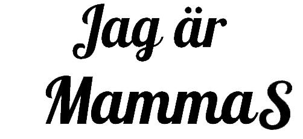

### December 2021
# Digital Skapande 1
## Projektuppgift *Ursula Vallejo Janne*
### Content Innehåller:

- [1. General Projektplan](#1-general-projektplan-)
- [2. Dokumentation](#2-dokumentation--)
    - [Steg 1: HTML](#steg-1-html)
    - [Steg 2: Central Main image ](#steg-2-central-main-image)
    - [Steg 3: Text Head](#steg-3-text-head)
    - [Steg 4: Text and sound](#steg-4-text-and-sound)
    - [Steg 5: Seven narratives related with the story](#steg-5-seven-narratives-related-with-the-story):
        - [1. Sensitive to sound ](#1-sensitive-to-sound)
        - [2. Sensitive to smell ](#2-sensitive-to-smell)
        - [3. Toys in order ](#3-toys-in-order)
        - [4. Problems texture food](#4-problems-texture-food)
        - [5. Communication ](#5-communication)
        - [6. Loving kid](#6-loving-kid)
        - [ 7. Different interest](#7-different-interest--math-dinosaurier-solar-system-natur-and-minekraft)
- [3.Uppgifter Info](#3-uppgifter-info)

# 1. General Projektplan :

For develop the project I used the waterfall method for clear up the general idea and be able to develop a diagram for what will be included on the project and how I plan to develop it.

### Metoder för utveckla projektet:

### Phase 1: Planning
On the first phase of the project have tried to do an analysis of what are the requirements for a digital project. The different options to develop a project using for example photos, videos, animation , sound or text for exempel.
On that stage I realized that was important for me to have first and  idea to work for and after trying to find which method for production I should use to express myself.

As we don't have any parameters of what topic we should use as the main idea , and we can choose what  better suit for us to develop in the project, I decided to make it a little more personal. That way has and adds  value to me. I thought that I could try to make the effort to transmit something that is important and near for me, as is having your child diagnosed with Autism.

After I decided I would like to do the project based on my son I did a brainstorm of what topics can work with, what element's on his development were different compared with other kids, and how I can define him nowadays.

On a first stage after doing the brainstorm thought that would like to do a video to narrate and history based on my son development and what he has reached and try to transmit the idea to don't let anyone put boundaries to kids, and that we all are in certain way different from each other and these particularities most be seen as and different way to approach the reality and  as power they have, that in certain way makes them stronger. I see my son proudly as a warrior or superhero that every day has taught me the truly important value of things in life and to never give up and to fight to be a better person.

As my plan was to do a narration with different aspects, my first approach was to think on a video, as is the most common used tool nowadays to describe what going on in our daily lives. For example: instagram, facebook and YouTube. And for been able to create a narrative my fist taught was the video as was the nearest, but after the selection of the items would like to include in the project I thought that as well a tool as a webpage can also work for that purpose. Also adding that at the moment im studying the course of web development and believed was more pertinent to try to express my idea of the narrative of my son through that media.

After the brainstorm I took 7 main ideas that could implement in my project as are some particularities with the kids with ASD( Autism spectrum disorder), related with the perception of the environment as: 
-sensitivity to the sound
-sensitivity to strong smells
-Problems with some textures with the food

 And other behaviour or cognitive aspects as:
- Place their toys in order
- Communication, as usually have delay at speaking need pictograms (images) in most of the cases.

Other aspects related with that how I perceive my son nowadays:
- As a loving boy
- Have different interest and learn a lot of them as mathematics, dinosaurs, solar system, natur, fishing and Minecraft.

### Phase 2: Design

On the second stage of the project, once the idea of the project was clear and knew with aspects would like to work on it,  I started to try to create a diagram or a draft of how I would like to create a layout for the webpage that you can see below:

### Diagram projektet :

### Main concept for the  HTML page:

As the idea was to generate a narration around few aspects of my son, and him as a superhero, decide that I would like to use a layout where he is in the center of attention of the web page as a superhero and the different narrations surround him and are in loop so anyone can read visually them in any stage.
To make sure that someone is able to understand what I would like to transmit, and is also able to create  the different relations with the images that are showed in the webpage, I decide to include a sound on the page with a narration, a story that I wrote using the perspective of a boy that narrates how was his development, and describes the power his moms sees on him.
The seven narratives of those aspects I select previously, thought that would like them to be dynamic, that the general project has some movement that's why I decide that would use video and gif format on them. More playful as has relation with a childhood that learn more through teaching them  playing.
For each narrative try to visualice the main concept to figure out the approach that better suit for generate that content, and image that describe the idea. This will be explained ahead in the documentation, where I describe each of the seven ideas.

### Phase 3: Development

To be able to start with this phase it was needed  to have a draft of what would like to have on the webpage (layout) and the concept of the project.  I planned a time frame to  have time to create all the content need it. Each  visual content was based on the analysis that was done previously, related in how to express each of the seven narratives on the formats that I choose as video and gif. After these I was able to start with the process of creation of the content that was needed to been able to create the general project.
At the same time that I start working on this process try to keep a record of the stages I followed to be able to describe the digital creative process that was needed it for the course of  'Digital Skapande'.
The process I followed and the information on this developing process could be read more in detail on the documentation part, as each process is described there.

### Phase 4: Launch, testing

The deadline we have for the project count as the launch of product. Once that i ensamble all the pieces on the webpage was needed to control that they were actually working. Work also in the last adjustments of the CSS to adjust the size och each narration and see that actually the composition of the web page have a good balance between the elements  and the same time give the feeling to be dynamic. Once this was double-checked and adjust, I was able to launch my project.

[GIT Ursula Vallejo ](https://trello.com/invite/b/Z3Nuvnwx/986973450a0dfb68d65c026a87d672d2/programmering-1)

# 2. Dokumentation  :

### Different parts of the project:

## Steg 1: HTML
- Layout  / around main bild of the boy superhero
- elements inside
- sound that is the history
- button where open the story.

### About the process:

  * Vilka verktyg har du använt dig av och varför?
    (Ex. Googles bildsök och GIMP)

* Vad gestaltar du med ditt verk?
  (Ex. Att Stefan Löfven byter karriärbana och att framtiden är oklar för honom.)

Digitala spridningsvägar
* Hur gick processen till med att skapa din produktion?
  (Beskriv så noga och utförligt som möjligt stegen som du har gått igenom)

## Steg 2: Central Main image 
-css animation eller gif
- draw as a kid. imaginario infantil de usar disfraz casero.

### About the process:

* Vilka verktyg har du använt dig av och varför?
  (Ex. Googles bildsök och GIMP)

* Vad gestaltar du med ditt verk?
  (Ex. Att Stefan Löfven byter karriärbana och att framtiden är oklar för honom.)

Digitala spridningsvägar
* Hur gick processen till med att skapa din produktion?
  (Beskriv så noga och utförligt som möjligt stegen som du har gått igenom)

## Steg 3: Text Head
-typography

-retouch image and filter.

- information take it on internet and retouch it. 
original  and transformation.

### About the process:

* Vilka verktyg har du använt dig av och varför?
  (Ex. Googles bildsök och GIMP)

* Vad gestaltar du med ditt verk?
  (Ex. Att Stefan Löfven byter karriärbana och att framtiden är oklar för honom.)

Digitala spridningsvägar
* Hur gick processen till med att skapa din produktion?
  (Beskriv så noga och utförligt som möjligt stegen som du har gått igenom)

## Steg 4: Text and sound

- they are related.
- -work in a history related  with the experience of the grown upp of my son . Particularities of the kids that have TEA. Why mom see him as a super hero. After all the difficulties he is loving child that have a lot of interests and how have teach us as  parents at never give upp and don't let anyone  put boundaries for what he can do.
For that I wrote the particularities he had when was lite and are common for TEA and at the end was make him what he is know ... how he has evolved and identify him.
Have select 7 different aspects to show in the history and each has a gif or video that reflectes it but all are part of the main history that is played with the narrative in the sound.

- when start web side start automatic the sound.
- we have a button that open the text to be read.
- perspective of the story as the kid tell it.

### About the process:

* Vilka verktyg har du använt dig av och varför?
  (Ex. Googles bildsök och GIMP)

* Vad gestaltar du med ditt verk?
  (Ex. Att Stefan Löfven byter karriärbana och att framtiden är oklar för honom.)

Digitala spridningsvägar
* Hur gick processen till med att skapa din produktion?
  (Beskriv så noga och utförligt som möjligt stegen som du har gått igenom)

### Text Narrative:

## Steg 5: Seven narratives related with the story

### 1. Sensitive to sound:

### About the process:

* Vilka verktyg har du använt dig av och varför?
  (Ex. Googles bildsök och GIMP)

* Vad gestaltar du med ditt verk?
  (Ex. Att Stefan Löfven byter karriärbana och att framtiden är oklar för honom.)

Digitala spridningsvägar
* Hur gick processen till med att skapa din produktion?
  (Beskriv så noga och utförligt som möjligt stegen som du har gått igenom)

### 2. Sensitive to smell:

### About the process:

* Vilka verktyg har du använt dig av och varför?
  (Ex. Googles bildsök och GIMP)

* Vad gestaltar du med ditt verk?
  (Ex. Att Stefan Löfven byter karriärbana och att framtiden är oklar för honom.)

Digitala spridningsvägar
* Hur gick processen till med att skapa din produktion?
  (Beskriv så noga och utförligt som möjligt stegen som du har gått igenom)

### 3. Toys in order:

### About the process:

* Vilka verktyg har du använt dig av och varför?
  (Ex. Googles bildsök och GIMP)

* Vad gestaltar du med ditt verk?
  (Ex. Att Stefan Löfven byter karriärbana och att framtiden är oklar för honom.)

Digitala spridningsvägar
* Hur gick processen till med att skapa din produktion?
  (Beskriv så noga och utförligt som möjligt stegen som du har gått igenom)

### 4. Problems texture food:

### About the process:

* Vilka verktyg har du använt dig av och varför?
  (Ex. Googles bildsök och GIMP)

* Vad gestaltar du med ditt verk?
  (Ex. Att Stefan Löfven byter karriärbana och att framtiden är oklar för honom.)

Digitala spridningsvägar
* Hur gick processen till med att skapa din produktion?
  (Beskriv så noga och utförligt som möjligt stegen som du har gått igenom)

### 5. Communication 

### About the process:

* Vilka verktyg har du använt dig av och varför?
  (Ex. Googles bildsök och GIMP)

* Vad gestaltar du med ditt verk?
  (Ex. Att Stefan Löfven byter karriärbana och att framtiden är oklar för honom.)

Digitala spridningsvägar
* Hur gick processen till med att skapa din produktion?
  (Beskriv så noga och utförligt som möjligt stegen som du har gått igenom)

### 6. Loving kid:

### About the process:

* Vilka verktyg har du använt dig av och varför?
  (Ex. Googles bildsök och GIMP)

* Vad gestaltar du med ditt verk?
  (Ex. Att Stefan Löfven byter karriärbana och att framtiden är oklar för honom.)

Digitala spridningsvägar
* Hur gick processen till med att skapa din produktion?
  (Beskriv så noga och utförligt som möjligt stegen som du har gått igenom)

### 7. Different interest : MAth, dinosaurier, solar system, natur and Minekraft.

### About the process:

* Vilka verktyg har du använt dig av och varför?
  (Ex. Googles bildsök och GIMP)

* Vad gestaltar du med ditt verk?
  (Ex. Att Stefan Löfven byter karriärbana och att framtiden är oklar för honom.)

Digitala spridningsvägar
* Hur gick processen till med att skapa din produktion?
  (Beskriv så noga och utförligt som möjligt stegen som du har gått igenom)

## 3. Uppgifter Info

###Ämnesmål

Kunskaper om digitala och analoga skapandeprocesser.
Förmåga att skapa och gestalta olika uttryck med digitala verktyg.
Kunskaper om digitala verktyg för att skapa och gestalta olika uttryck.
Förmåga att samarbeta via webb och nätverk, både synkront och asynkront.
Kunskaper om plattformar för digitalt samarbete.
Kunskaper om olika presentations- och spridningsvägar för digitala produktioner.
Centralt innehåll Digitalt Skapande 1
Analoga och digitala skapandeprocesser, skissarbete både utan och med digitala verktyg.
Gränslandet mellan konst och teknik samt hur det formar skapandeprocesser.
Kombinationer av olika uttryck för digitala produktioner.
Digitala verktyg för skapande och gestaltande. Hur man väljer lämpligt verktyg för skapande och bevarande.
Programvara och hårdvara som används för skapande i olika estetiska uttrycksformer.
Samarbetsformer vid digitala produktioner.
Presentationsvägar och spridningsvägar för digitala produktioner, till exempel internet, digitala tryck och olika lagringsmedier.

###Betygskriterier

####Betyget E

Eleven redogör översiktligt för någon digital eller analog skapandeprocess. I eget skapande och gestaltande prövar eleven med viss säkerhet digitala verktyg och några olika estetiska uttryck. Eleven gör en enkel jämförelse av olika verktygs användbarhet för olika ändamål. Eleven väljer i samråd med handledare lämplig programvara eller hårdvara för några olika uttryck. Dessutom motiverar eleven översiktligt sina val av program- eller hårdvara.
Eleven samarbetar med viss säkerhet med andra i sin digitala produktion och kommunicerar med viss säkerhet via webb och nätverk. Eleven redogör översiktligt för olika presentations- och spridningsvägar för digitala produktioner.
När eleven samråder med handledare bedömer hon eller han med viss säkerhet den egna förmågan och situationens krav.

#### Betyget D

 Betyget D innebär att kunskapskraven för E och till övervägande del för C är uppfyllda.

#### Betyget C

Eleven redogör utförligt för några digitala och analoga skapandeprocesser. I eget skapande och gestaltande prövar och använder eleven med viss säkerhet digitala verktyg och några olika estetiska uttryck. Eleven gör en välgrundad jämförelse av olika verktygs användbarhet för olika ändamål.
Eleven väljer efter samråd med handledare lämplig programvara eller hårdvara för några olika uttryck. Dessutom motiverar eleven utförligt sina val av program- eller hårdvara.
Eleven samarbetar med viss säkerhet med andra i sin digitala produktion och kommunicerar med viss säkerhet via webb och nätverk. Eleven redogör utförligt för olika presentations- och spridningsvägar för digitala produktioner. Dessutom producerar eleven själv i några olika format. *När eleven samråder med handledare bedömer hon eller han med viss säkerhet den egna förmågan och situationens krav.

####Betyget B

Betyget B innebär att kunskapskraven för C och till övervägande del för A är uppfyllda.

####Betyget A

Eleven redogör utförligt och nyanserat för flera digitala och analoga skapandeprocesser. I eget skapande och gestaltande prövar och använder eleven med säkerhet digitala verktyg och några olika estetiska uttryck. Eleven gör en välgrundad och nyanserad jämförelse av olika verktygs användbarhet för olika ändamål. Eleven väljer efter samråd med handledare lämplig programvara eller hårdvara för några olika uttryck. Dessutom motiverar eleven utförligt och nyanserat sina val av program- eller hårdvara.
Eleven samarbetar med säkerhet med andra i sin digitala produktion och kommunicerar med säkerhet via webb och nätverk. Eleven redogör utförligt och nyanserat för olika presentations- och spridningsvägar för digitala produktioner. Dessutom producerar eleven själv i några olika format samt motiverar utförligt och nyanserat sina val av format.
När eleven samråder med handledare bedömer hon eller han med säkerhet den egna förmågan och situationens krav.