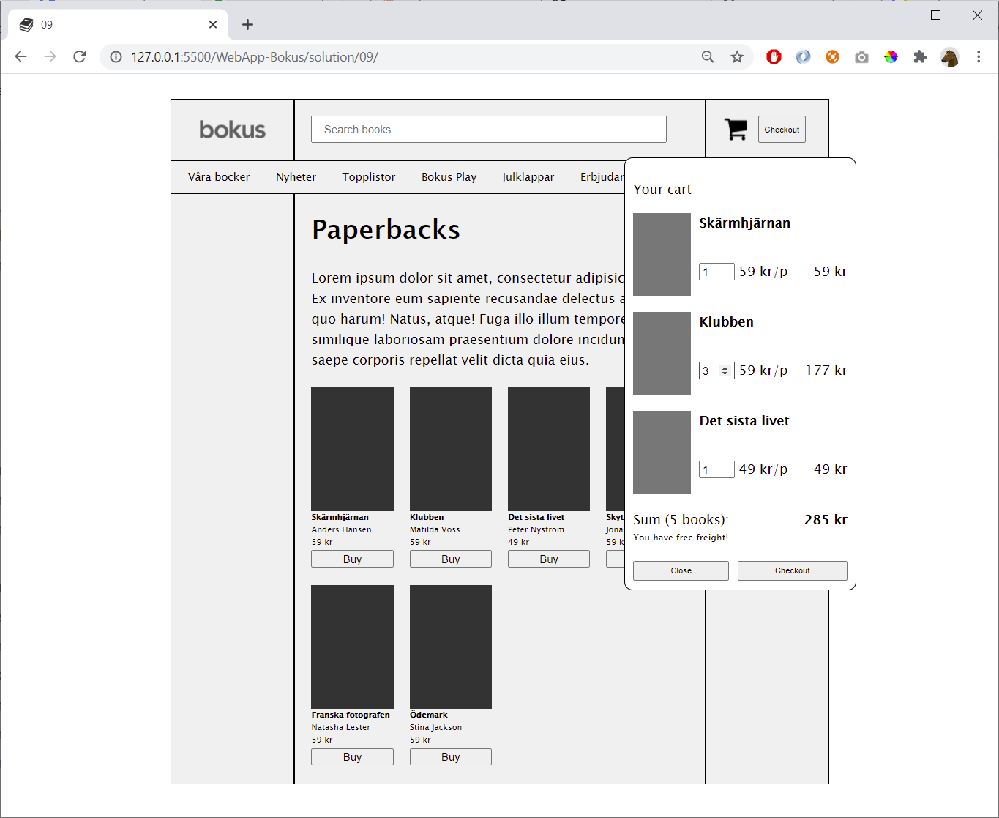

### Oktober 2021
# Programmering 1
## Projektuppgift *Ursula Vallejo Janne*
### Content Innehåller:

- [1. General Projektplan](#1-general-projektplan-)
- [2. Dokumentation](#2-dokumentation--)
    - [Steg 1: HTML](#steg-1-html)
    - [Steg 2: CSS](#steg-2-css)
    - [Steg 3: JS](#steg-3-js)
    - [Steg 4: Beskrivning](#steg-4-beskrivning)
    - [Steg 5: konklusionen](#steg-5-konklusionen)
    - [Steg 6: övriga](#steg-6-vriga)
  
- [3.Uppgifter Info](#3-uppgifter-info)

# 1. General Projektplan :

Du kan se mitt projektplan i länken nedan:

[Trello Webbsida ](https://trello.com/invite/b/Z3Nuvnwx/986973450a0dfb68d65c026a87d672d2/programmering-1)

# 2. Dokumentation  :

## Steg 1: HTML

- search images cd, shoppingcart and logo (photoshop background transparent)
- create layout : semanstisc sections
- difficultad al poner el carrito y centrar el head
- logo css?
- centrar head con main. opte por hacer un marco externo para centrat todo. tomado del libro pg 325 (trabajar con boxes)
- item (cd) con un flexbox
- cada item en un span para incluir toda la informacion de cada articulo separada.
- crear en css un card style para resaltar el item se escoge. w3 schools .

--add google fonts: import link and copy and paste it on the head as link ref:
https://fonts.google.com/

-ion icons : usage (copy script) and add it to `<script src>`
the other link find installation (copy it) and add it to the head <link href:' '  rel:'stylesheet'>
before the style.css

https://ionic.io/ionicons

## Steg 2: CSS

## Steg 3: JS

-crear un diagrama para entender las funciones deben existir en la pagina.

- crear pasos a seguir en trello
- ## orden de elementos que encontre en mi diagrama:  
1. boton de checkout que sea sencible y abra el dropdown
1 crear el dropdown menu ( como cambiar el tamano de este)
2. generar los espacios para anadir el contenido
3. anadir los 2 botones del carrito ( 1 close 2 check out) mirar que sean sencibles con el curso y anadir a cada uno funcion 1 de abrir y cerrar el dropmenu y el otro un alert.
4. los botones de buy en los elementos deben ser sencibles con el cursor.
5. los item en el carrito deben tener la imagen,titulo album, un input para cantidad x unidad, precio individual y precio general de esa seleccion.
6. al final de los elementos debe haber un texto que diga que cantidad de cd se anadieron al carrito y la suma total.
7. una linea de texto que diga si con la cantidad se opta a envio gratuito. 2 posibles escenarios: A. Free freight over 259kr ( 51 kr left)
B. You have free freight.
8. have a button to remove and uptate the items on the cart.

- ## orden de funciones que encontre en mi diagrama:
1.function that add the item we see on the page to the cart. Related with Button Buy.

2. function related with button checkout that open the menu.
3. function related with the button on the cart to close the dropdownmenu.
4. function alert in the to checkout button on the cart.
5. function that count the number of products of each item selected  and multiply and give a subtotal item.
6. function to add all the sum of subtotal
7.function that count the total of cd were chosen is included in the text after sum:()
8.function to evaluated free freight and print ut two different scenarios. Print out evaluation.
 

- ## Dificultades encontradas y como se solucionaron:

1. Como anadir los items de la pagina principal al carrito?

2. function pay / convert elements of an array into a string: w3 schools (let energy= fruits.join())

recursos:
https://www.youtube.com/watch?v=yASvgVh8p5A

https://www.youtube.com/watch?v=B20Getj_Zk4
https://www.youtube.com/watch?v=tEAl7L62GEw

https://www.youtube.com/watch?v=dSbWJAXQ7cA&t=606s

## Steg 4: Beskrivning

## Steg 5: konklusionen

## Steg 6: övriga

## 3. Uppgifter Info

### Frågeställningen

Hur kan vi göra en kundkorg som uppdateras.

### Mål

I detta projekt ska ni göra en enkel hemsida där man kan lägga album man vill köpa i en kundkorg. Man ska kunna
uppdatera antalet album samt att när en viss summa nås får man fri frakt.

### Avgränsning

HTML och CSS för det grafiska gränssnittet och Vanilla JavaScript för funktionaliteten. Dvs ingen:

- JQuery
- Media Queries (Frivilligt)
- JavaScript Frameworks

### Syfte

Att ni ska lära er vad JavaScript tillför för funktionalitet samt vilket möjligheter det ger för programutveckling.

### Vad ska ni leverera?

En applikation med en kundkorg, där man ska kunna

- Visa vilka album som finns
- Lägga till album i en kundkorg
- Ta bort album i en kundkorg
- Uppdatera antalet album i en kundkorg

### Lägg till varor i kundkorgen

### Funktioner som ska finnas

- När användaren ändrar antalet album så ska summan uppdateras med en gång.

- Det ska inte vara möjligt att skriva in felaktiga värden så som negativa värden i "antalet album boxarna".

- Kundkorgen ska vara tillgänglig från bilden på en kundkorg samt knappen "Checkout".

- Om ordern är på mer än 259kr (eller lika med) så ska det vara fri frakt. Om summan för fri frakt inte uppnåtts så visa
  hur långt (skillnaden) det är kvar till fri frakt:

