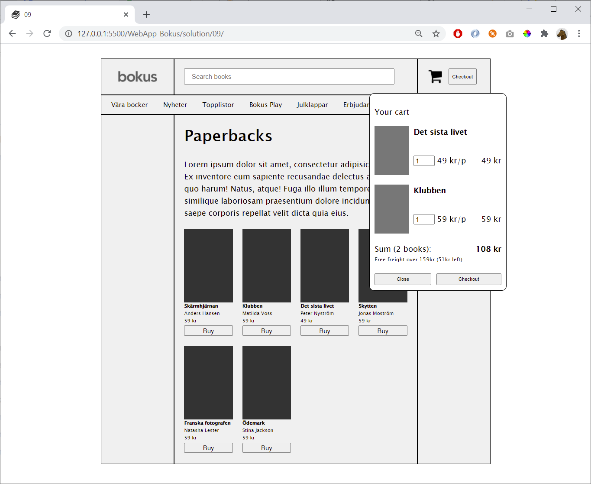

### Oktober 2021
# Programmering 1
## Projektuppgift *Ursula Vallejo Janne*
### Content Innehåller:

- [1. General Projektplan](#1-general-projektplan-)
- [2. Dokumentation](#2-dokumentation--)
    - [Steg 1: HTML](#steg-1-html)
    - [Steg 2: CSS](#steg-2-css)
    - [Steg 3: JS](#steg-3-js)
    - [Steg 4: konklusionen](#steg-5-konklusionen)
    - [Steg 5: övriga](#steg-6-vriga)
  
- [3.Uppgifter Info](#3-uppgifter-info)

# 1. General Projektplan :

I informationen om projektet i trello jag utarbetade det baserat på den analys som jag gjorde av projektet på musikwebbplatsen och lägga till de delar av kraven krävs i detta. 

De punkter som delar upp projektet kan ses mer detaljerat i dokumentationsavsnittet.

I mitt projekt kan du se en karta för varje Steg i projektet, en beskrivning av kraven i varje och de detaljer som arbetades med.
Också ett kort för varje som krävs för att få kvalifikationer.

Du kan se mitt projektplan i länken nedan:

[Trello Webbsida ](https://trello.com/invite/b/Z3Nuvnwx/986973450a0dfb68d65c026a87d672d2/programmering-1)

I kursen har vi använt Trello-programmet för att kunna följa en organiserad arbetsplan, som styr projektmålen och kvalifikationskraven.

Detta program hjälper dig att tydligt visualisera de avsnitt du arbetar med inom ett projekt.

På så sätt kan du hålla reda på vad som fungerar och vad som behöver göras. Således är man mer medveten om var projektet är och garanterar ett bättre resultat genom att inte utelämna saker på grund av glömska.

Jag tyckte personligen att det var mycket användbart att kunna styra och övervaka varje steg i projektet.

# 2. Dokumentation  :

Projektet består av att göra en musik-CD-butik där en kundvagn visas.  I kundvagnen kan du öka mängden av produkterna och ge oss en delsumma och ett totalt värde på kundvagnen.
I varukorgen får vi också information om det totala antalet CD nummer som har lagts till den och om inköpsvärdet gör att vi väljer gratis frakt eller hur mycket vi behöver för att komma åt detta.

Det första steget jag tog var att ta de 2 bilderna av projektet och gå in där vilka funktioner som ska höjas från vad som visualiseras i dokumentet på webben.

Vi ser detta nedan:


### Från diagrammet ovan hittade jag följande element som jag måste utveckla i projektet:

1. Checkout knapp som är flyttbar och öppnar listrutan.

2. Generera html för att lägga till innehållet.

3. två knappar behövs för öppnar varukorgen; den ena är en bild och den andra en knapp(se ut som om de är känsligt med mouse markören).

4. Inuti kundkorgen finns det två knappar i slutet av innehållet. man måste stänga rullgardinsmenyn och den andra visar ett varningsmeddelande när du checkar ut (se ut som om de är känsligt med mouse markören).

5. De artiklar som läggs till i kundvagnen måste ha bilden, artistnamnet, albumtiteln, en input för att variera kvantiteten på den produkten, den totala summan som är förhållandet mellan enheterna med priset och en knapp för att ta bort artikeln från varukorgen.

Valet som görs i input måste variera det belopp som ska betalas och när 0 produkter läggs tar det bort varan från kundvagnen.
 
6.i slutet av kundvagnen efter produkter, finns det en text som säger hur många cd-skivor som lades till i varukorgen och summan av alla produkter har valts.

7. En rad under Summary texten finns en textrad som säger om du med det belopp du väljer för fri frakt. Det finns två möjliga scenarier: 
    * A. Free freight over 259kr ( XX value kr left for free freight)
   * B. You have free freight.
   

### Från den första analysen utarbetade jag en karta över de steg som jag var tvungen att följa för utarbetandet av projektet som består av följande:

1.Skapa projektet i trello med de olika stegen att följa som jag identifierar i mitt projekt.

2.Skapa en allmän projektmapp som innehåller:
   * img mapp, README.md, index.html, style.css och script.js.

3.Generera html-innehåll för att kunna skriva den allmänna layouten för innehållet i musikarkivet med semantisk inledning.

4.Arbeta med CSS för att kunna ha butikens visuella layout.

5.Börja med javascript för att utveckla de funktioner som du bryter ut i analysdiagrammet för projektbilden som vi ser i början av den här dokumentationen. 

6. Kontrollera att sidan fungerar korrekt och att det inte finns några felmeddelanden på den.

7. Senaste Layoutinställningarna med CSS.

8. Den dokumentation som har genererats under utarbetandet av projektet kommer att vidarebefordras i README.

Nedan finns 3 avsnitt ett för html, ett annat för css och slutligen för JS där jag beskriver processen mer detaljerat i den process jag har haft i samband med utvecklingen av dessa i mitt projekt


## Steg 1: HTML

Detta är de steg som jag har följt när det gäller HTML för utvecklingen av detta projekt som jag också inkluderar om jag har haft några svårigheter och hur jag har löst det.

1. Söka efter 8 bilder, Storelogo och information för  musikbutiksprodukter för att kunna koppla dem till projektet.
  ``````
   * lösning av problemet: 
   
   Bildens logotyp kom inte med en transparent bakgrund genom vilken den passerar i png-format och omvandlar den för att radera bakgrunden med Photoshop.


2.I webbhuvudet jag har skapat en Header med butikens logotyp ett sökfält och en knapp + en bild av kundvagnen.


3.Skapat en NavBar med optioner men inte functional.
    ```<navbar> / <ul>```

4.Skriva textinnehållet i huvudavsnittet.
    ```html <main> / <section> / <h1> <p>```

5.Skapat en Template för produktartiklar i html.
    ```html <main> / <section> / <article>```

## Steg 2: CSS
difficultad al poner el carrito y centrar el head
- logo css?
- centrar head con main. opte por hacer un marco externo para centrat todo. tomado del libro pg 325 (trabajar con boxes)
- item (cd) con un flexbox
- cada item en un span para incluir toda la informacion de cada articulo separada.


--add google fonts: import link and copy and paste it on the head as link ref:
https://fonts.google.com/

-ion icons : usage (copy script) and add it to `<script src>`
the other link find installation (copy it) and add it to the head <link href:' '  rel:'stylesheet'>
before the style.css

https://ionic.io/ionicons


## Steg 3: JS

Escribir funciones??
      * Det första den genererar var dropdownmenu för att kunna organisera innehållet i kundvagnen.
-crear un diagrama para entender las funciones deben existir en la pagina.

-
- ## orden de funciones que encontre en mi diagrama:
1.function that add the item we see on the page to the cart. Related with Button Buy.

2. function related with button checkout that open the menu.
3. function related with the button on the cart to close the dropdownmenu.
4. function alert in the to checkout button on the cart.
5. function that count the number of products of each item selected  and multiply and give a subtotal item.
6. function to add all the sum of subtotal
7.function that count the total of cd were chosen is included in the text after sum:()
8.function to evaluated free freight and print ut two different scenarios. Print out evaluation.
 

- ## Dificultades encontradas y como se solucionaron:

1. Como anadir los items de la pagina principal al carrito?

2. function pay / convert elements of an array into a string: w3 schools (let energy= fruits.join())

## Steg 4: konklusionen

## Steg 5: övriga
recursos:
https://www.youtube.com/watch?v=yASvgVh8p5A

https://www.youtube.com/watch?v=B20Getj_Zk4
https://www.youtube.com/watch?v=tEAl7L62GEw

https://www.youtube.com/watch?v=dSbWJAXQ7cA&t=606s
## 3. Uppgifter Info

### Frågeställningen

Hur kan vi göra en kundkorg som uppdateras.

### Mål

I detta projekt ska ni göra en enkel hemsida där man kan lägga album man vill köpa i en kundkorg. Man ska kunna
uppdatera antalet album samt att när en viss summa nås får man fri frakt.

### Avgränsning

HTML och CSS för det grafiska gränssnittet och Vanilla JavaScript för funktionaliteten. Dvs ingen:

- JQuery
- Media Queries (Frivilligt)
- JavaScript Frameworks

### Syfte

Att ni ska lära er vad JavaScript tillför för funktionalitet samt vilket möjligheter det ger för programutveckling.

### Vad ska ni leverera?

En applikation med en kundkorg, där man ska kunna

- Visa vilka album som finns
- Lägga till album i en kundkorg
- Ta bort album i en kundkorg
- Uppdatera antalet album i en kundkorg

### Lägg till varor i kundkorgen


### Funktioner som ska finnas

- När användaren ändrar antalet album så ska summan uppdateras med en gång.

- Det ska inte vara möjligt att skriva in felaktiga värden så som negativa värden i "antalet album boxarna".

- Kundkorgen ska vara tillgänglig från bilden på en kundkorg samt knappen "Checkout".

- Om ordern är på mer än 259kr (eller lika med) så ska det vara fri frakt. Om summan för fri frakt inte uppnåtts så visa
  hur långt (skillnaden) det är kvar till fri frakt:

