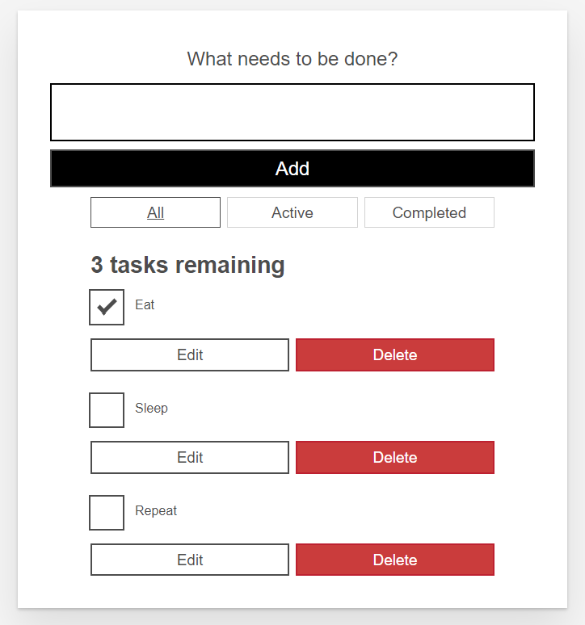

### Mars 2022
# WebbserverProgrammering 1
## Projektuppgift *Ursula Vallejo Janne*
### Content Innehåller:

- [1. General Projektplan](#1-general-projektplan-)
- [2. UX](#2-ux-)
    - [A. Prototyp](#a-prototyp)
    - [B. Font](#b-font-)
    - [C. Färgschema](#c-frgschema)
- [3. Projektgenomförande](#3-projektgenomfrande-)
    - [ Funcionen i projekten ](#funcionen-i-projekten)
    - [ Tester](#tester)
    - [ Nya koncept ](#nya-koncept)
    - [ Svårigheter ](#svrigheter)
    - [ Konklusionen](#konklusionen)


# 1. General Projektplan :

I WebbserverProgrammering 1 projektet består av två delar, generera en backend och därifrån utveckla innehållet i en version av TODO.

Den första delen som skulle göras var backend och frontend-implementeringen har gjorts i Rect.

I uppgiftsleveransmappen kan du se en mapp som motsvarar backend men för frontend finns det 2 versioner: 
-en enkel som täcker den väsentliga delen av leveransen.
-och det finns en andra fil där du kan hitta idén som du utvecklade inklusive en användare.
Senare kommer jag att förklara varför dessa två versioner finns.

En del av projektet är att ha en projektutvecklingsplan vars beståndsdelar är nedbrutna i Trello.

Du kan se mitt projektplan i länken nedan:

[Trello Webbsida ](https://trello.com/b/kmUZDY4f/webbserverprogrammering-1)

Varje fil har en README där du kan se de olika paketen som installerades. Här är en sammanfattning:

## Installera följande npm paket i min projekt:

```shell
BACKEND:
   npm init --y
   npm install 
   npm install cors express dotenv
   npm install -D nodemon
   Middlewares:
   npm install helmet morgan
   Tests:
   npm install -D mocha chai chai-http
   
FRONTEND:
   npm install react-icons
   npm install axios
   npm install tachyons@4.12.0
   npm install react-router-dom@6
   
```

<details>
<summary> # Getting Started with Create React App </summary>

This project was bootstrapped with [Create React App](https://github.com/facebook/create-react-app).

## Available Scripts

In the project directory, you can run:

### `npm start`

Runs the app in the development mode.\
Open [http://localhost:3000](http://localhost:3000) to view it in your browser.

The page will reload when you make changes.\
You may also see any lint errors in the console.

### `npm test`

Launches the test runner in the interactive watch mode.\
See the section about [running tests](https://facebook.github.io/create-react-app/docs/running-tests) for more information.

### `npm run build`

Builds the app for production to the `build` folder.\
It correctly bundles React in production mode and optimizes the build for the best performance.

The build is minified and the filenames include the hashes.\
Your app is ready to be deployed!

See the section about [deployment](https://facebook.github.io/create-react-app/docs/deployment) for more information.

### `npm run eject`

**Note: this is a one-way operation. Once you `eject`, you can't go back!**

If you aren't satisfied with the build tool and configuration choices, you can `eject` at any time. This command will remove the single build dependency from your project.

Instead, it will copy all the configuration files and the transitive dependencies (webpack, Babel, ESLint, etc) right into your project so you have full control over them. All of the commands except `eject` will still work, but they will point to the copied scripts so you can tweak them. At this point you're on your own.

You don't have to ever use `eject`. The curated feature set is suitable for small and middle deployments, and you shouldn't feel obligated to use this feature. However we understand that this tool wouldn't be useful if you couldn't customize it when you are ready for it.

## Learn More

You can learn more in the [Create React App documentation](https://facebook.github.io/create-react-app/docs/getting-started).

To learn React, check out the [React documentation](https://reactjs.org/).

### Code Splitting

This section has moved here: [https://facebook.github.io/create-react-app/docs/code-splitting](https://facebook.github.io/create-react-app/docs/code-splitting)

### Analyzing the Bundle Size

This section has moved here: [https://facebook.github.io/create-react-app/docs/analyzing-the-bundle-size](https://facebook.github.io/create-react-app/docs/analyzing-the-bundle-size)

### Making a Progressive Web App

This section has moved here: [https://facebook.github.io/create-react-app/docs/making-a-progressive-web-app](https://facebook.github.io/create-react-app/docs/making-a-progressive-web-app)

### Advanced Configuration

This section has moved here: [https://facebook.github.io/create-react-app/docs/advanced-configuration](https://facebook.github.io/create-react-app/docs/advanced-configuration)

### Deployment

This section has moved here: [https://facebook.github.io/create-react-app/docs/deployment](https://facebook.github.io/create-react-app/docs/deployment)

### `npm run build` fails to minify

This section has moved here: [https://facebook.github.io/create-react-app/docs/troubleshooting#npm-run-build-fails-to-minify](https://facebook.github.io/create-react-app/docs/troubleshooting#npm-run-build-fails-to-minify)

</details>


# 2. UX :

Tanken är att det finns en login sida och efter användaren kan se ut hens TODOlist.

För att göra det mer dynamiskt föreslogs att layouten skulle ha animationer. 
Den viktigaste är känslan av tidens gång för vilken det finns en cirkel som rör sig som klockans visare när de vänder sig om och markerar tidens gång.

Tillvägagångssättet är att användaren kommer åt webbsidan med inloggning där han kan se sin information från att göra-listan. 
Som om det vore en tidshanteringsapplikation för personligt bruk eller för din familj eller arbetsgrupp.

Grund ide med content management som jag ville implementera var baserad på att varje element kunde hantera alla funktioner som att uppdatera, ta bort och flytta till olika listor. Modellen är som följer:



- [Mozilla DEV: Todo list](https://developer.mozilla.org/en-US/docs/Learn/Tools_and_testing/Client-side_JavaScript_frameworks/React_todo_list_beginning)
- [Mozilla DEV: Todo list](https://mdn.github.io/todo-react-build/)

Jag tyckte att det var svårt att implementera det eftersom jag inte kunde få backend att fungera där. Välj därför följande layout för att hantera data, där det finns två knappar som öppnar en modal där de olika procedurerna kan utföras.


## A. Prototyp:

Utvecklingen av Wireframes för projektet utvecklades i Low Fidelity, eftersom projektet inte är komplext, så valde jag att bara utveckla den här skissen.


## B. Font :

FFör det här projektet valde jag att endast använda två typografier så att det skulle bli visuellt rent och utan mycket visuell information. Jag valde ett mer geometriskt typsnitt för vad det har att göra med en att göra-lista som är mer automatisk (relaterat till organisationsscheman).

Typeface jag valde var följande:

1. Permanent Marker
   
2. Architects Daughter
   


Länkar:
- [Type-Scale](https://type-scale.com/)

## C. Färgschema: 

Grund färgs metoden är djupblå som är relaterad till visuellt lugn men jag valde att använda kontrasterande färger för att skapa en layout med en mer modern look, ung, för vilken kontrastfärger som rosa, smaragdgrön och vit används grund för fonts och informationen på sidan. (animering av livliga primärfärger).

##Final Color Palette:

Här färgskalan du använde i projektet:


# 3. Projektgenomförande :

Sedan berättar jag processen jag var tvungen att utveckla projektet.

## Funcionen i projekten:


## Tester:

* Backend:
* Frontend:

## Nya koncept:

Jag hittade två koncepter som verkade intressanta för mig i utvecklingen:

- context :
  Jag använder den för att kunna generera ett globalt sammanhang på sidan och ha informationen för hela projektet, tillgång till funktionerna och shop array för produkterna att köpa.

- [Context i react](https://es.reactjs.org/docs/context.html)

- .map:
  För att kunna använda en ny array som jag använder för att överföra produkterna från butiken till varukorgen.

Hittade info här:

- [How to Use the Map](https://www.pluralsight.com/guides/how-to-use-the-map()-function-to-export-javascript-in-react)

- .concat:
  Jag använd den för att kunna kopiera värdena och kunna ha en likvärdighet inom dem.
- [Array.prototype.concat()](https://developer.mozilla.org/es/docs/Web/JavaScript/Reference/Global_Objects/Array/concat)

## Svårigheter:

När jag implementerade i react de funktioner som jag hade skapat i det tidigare programmeringsprojektet, hittade jag några implementeringsproblem som jag beskriver nedan vad de var och hur de har lösts:

1.Hitta ett sätt att skapa ett sammanhang i projektet som jag hittade flera lösningar för och frågade min lärare om han kunde implementera det jag såg i följande handledning:

- [React Tutorial](https://www.youtube.com/watch?v=Dorf8i6lCuk&t=10507s)


<summary> # Meet up Context code i used </summary>

```shell
import { createContext, useState } from 'react';

const FavoritesContext = createContext({
favorites: [],
totalFavorites: 0,
addFavorite: (favoriteMeetup) => {},
removeFavorite: (meetupId) => {},
itemIsFavorite: (meetupId) => {}
});

export function FavoritesContextProvider(props) {
const [userFavorites, setUserFavorites] = useState([]);

function addFavoriteHandler(favoriteMeetup) {
setUserFavorites((prevUserFavorites) => {
return prevUserFavorites.concat(favoriteMeetup);
});
}

function removeFavoriteHandler(meetupId) {
setUserFavorites(prevUserFavorites => {
return prevUserFavorites.filter(meetup => meetup.id !== meetupId);
});
}

function itemIsFavoriteHandler(meetupId) {
return userFavorites.some(meetup => meetup.id === meetupId);
}

const context = {
favorites: userFavorites,
totalFavorites: userFavorites.length,
addFavorite: addFavoriteHandler,
removeFavorite: removeFavoriteHandler,
itemIsFavorite: itemIsFavoriteHandler
};

return (
<FavoritesContext.Provider value={context}>
{props.children}
</FavoritesContext.Provider>
);
}

export default FavoritesContext;
```

2. Att använda sammanhanget gav mig ett fel i konsolen som var följande:

```shell
Uncaught TypeError: this.props.data.map is not a function
```

Hittade lösning där jag förtydligade varifrån informationen som behöver implementeras kommer och hur den ska implementeras. Se nedan:

- [Stackoverflow](https://stackoverflow.com/questions/30142361/react-js-uncaught-typeerror-this-props-data-map-is-not-a-function)

3.När man tilldelade ett värde till ingången gav det mig ett felmeddelande eller vilket jag kunde fixa genom att ändra det till placeholder.

```shell
Failed form propType: You provided a `value` prop to a form field without an `onChange` handler
```
Hittade lösning i:

- [Stackoverflow](https://stackoverflow.com/questions/43556212/failed-form-proptype-you-provided-a-value-prop-to-a-form-field-without-an-on)


4. I följande tutorial om Redux vs Context såg jag flera alternativ för att generera funktioner för att relatera beräkningarna av kvantitet och värde. Men jag försökte implementera dem men de verkade väldigt komplexa för mig till slut så jag bestämde mig för att inte implementera dem och försök att hitta en lösning nära som jag gjort i min programmering 1 project och bestämde att gör rakningar om min Cart JS inte i min context. Till exempel jag inte implementera :

```shell
removeProductFromCart = productId => {
    console.log('Removing product with id: ' + productId);
    const updatedCart = [...this.state.cart];
    const updatedItemIndex = updatedCart.findIndex(
      item => item.id === productId
    );

    const updatedItem = {
      ...updatedCart[updatedItemIndex]
    };
    updatedItem.quantity--;
    if (updatedItem.quantity <= 0) {
      updatedCart.splice(updatedItemIndex, 1);
    } else {
      updatedCart[updatedItemIndex] = updatedItem;
    }
    setTimeout(() => {
      this.setState({ cart: updatedCart });
    }, 700);
  };

```
Länkar:

- [React redux vs Context](https://stackoverflow.com/questions/43556212/failed-form-proptype-you-provided-a-value-prop-to-a-form-field-without-an-on)
  https://github.com/academind/react-redux-vs-context/blob/context/src/context/GlobalState.js

5. Grow i Tachyons (CardItem.js).

När du gör layout i butiken för att göra stilen använd Tachyons. När jag lägger till artiklarna i butiken via köpknappen var det nödvändigt att trycka på den 2 gånger och det fungerade inte så bra.

Jag kunde inte förstå vad som hände och ta bort alternativet att växa och jag insåg att det genererade störningar i denna process så jag valde att också lägga till de återstående stilarna av css-moduler.

## Konklusionen

Projektet i allmänhet verkade ganska komplicerat att genomföra. Den första svårigheten jag stötte på var att kunna översätta Javascript-funktionerna som jag hade från mitt tidigare programmeringsprojekt_1 till React.

För att förstå hela processen sökte jag efter olika information om hur man utvecklade projektet i React, vilket jag tyckte var intressant eftersom jag bättre kunde förstå hur de olika delarna är sammanflätade inom projektet.

Även om det blev en svår process i slutändan är jag glad att jag kunde få implementeringen att fungera.

Det hjälpte mig mycket att se hur det globala sammanhanget fungerar i REACT-projekt och att förstå hur man kan komma åt informationen som finns där i resten av projektet.

Jag insåg också att min svaga punkt är javascript där jag tror att jag måste kunna träna mer för att kunna förstå det bättre och lättare kunna ställa in funktioner, speciellt när jag ställer in funktionsvillkor (if- else).

En annan aspekt som jag också tycker att jag borde lära mig att implementera är testerna med FireEvent eftersom det är svårt för mig när initialtillståndet är dynamisk information och inte fixerat.

Det har varit en erfarenhet som har hjälpt mig att analysera olika aspekter för att se var jag befinner mig i min kunskap, vad jag bör försöka förbättra och även se de positiva punkterna inom utbildningsprocessen.

