### September 2021
# Webbutveckling 1
## Projektuppgift *Ursula Vallejo Janne*
### Content Innehåller:
- [General Projektplan](#general-projektplan-)
- [Steg 1: about.html](#steg-1-abouthtml)
- [Steg 2: courses.html](#steg-2-courseshtml)
- [Steg 3: index.html](#steg-3-indexhtml)
- [Steg 4: blogg.html](#steg-4-blogghtml)
- [Steg 5: products.html](#steg-5-productshtml)
- [Steg 6: other.html](#steg-6-otherhtml)
- [Uppgifter Info](#uppgifter-info)

# General Projektplan :
I kursen har vi använt Trello-programmet för att kunna följa en organiserad arbetsplan, som styr projektmålen och kvalifikationskraven.
Du kan se mitt projektplan i länken nedan:

[Trello Webbsida ](https://trello.com/invite/b/MumOFN0P/9878ada236feb82b544166f8b5eddfc0/webbutveckling1)

# Dokumentation  :

## Steg 1: about.html

-Text 1

-text 2

-På denna webbplats har jag analyserat kompatibiliteten för olika enheter : iPhone 6-7, iPad och Desktop. Samt hur de ser ut i Goggle Chrome och Microsoft Edge.
  - iPhone:

    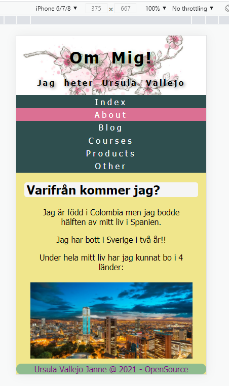
  - Ipad:

    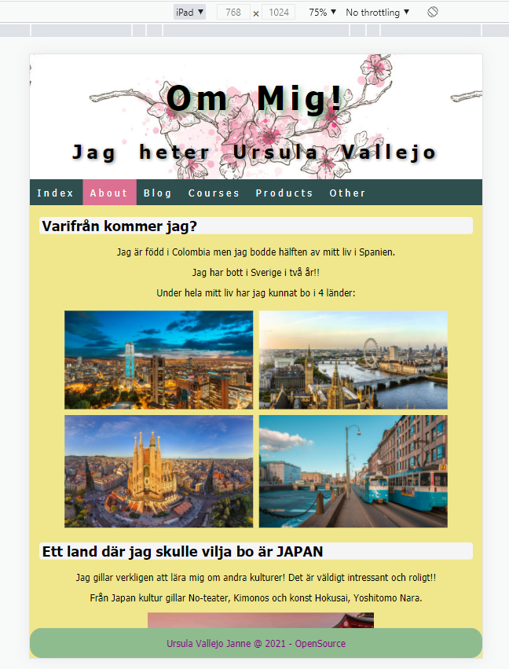
  - Desktop:

    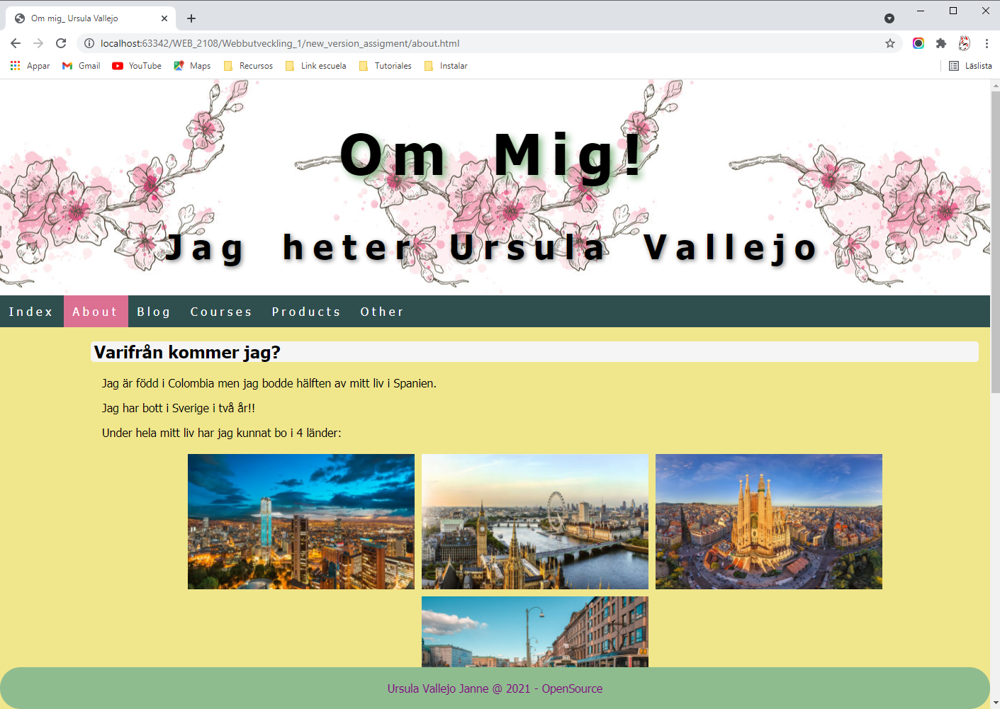

-text 4

-Text 5

-text 6

-text 7

-text 8

## Steg 2: courses.html

-Text 1

-text 2

-På denna webbplats har jag analyserat kompatibiliteten för olika enheter : iPhone 6-7, iPad och Desktop. Samt hur de ser ut i Goggle Chrome och Microsoft Edge.
- iPhone:

  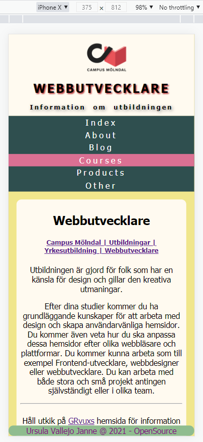
- Ipad:

  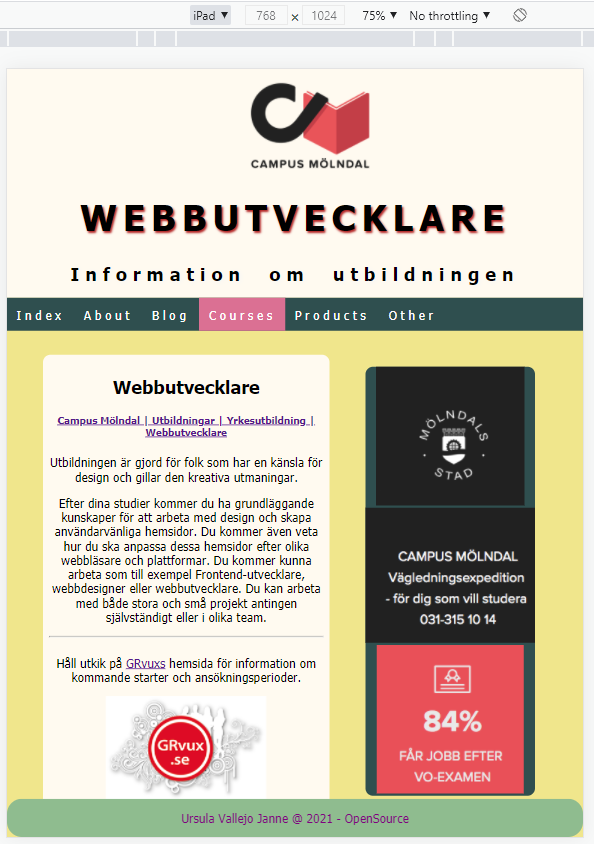
- Desktop:

  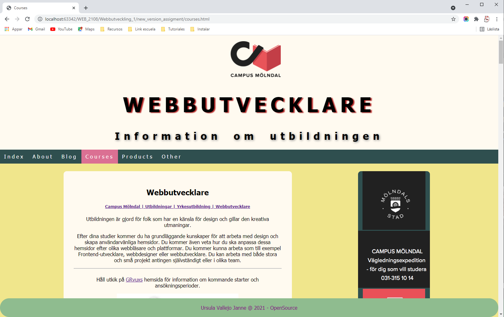

-text 4

-Text 5

-text 6

-text 7

-text 8

## Steg 3: index.html

-Text 1

-text 2

-På denna webbplats har jag analyserat kompatibiliteten för olika enheter : iPhone 6-7, iPad och Desktop. Samt hur de ser ut i Goggle Chrome och Microsoft Edge.
- iPhone:

  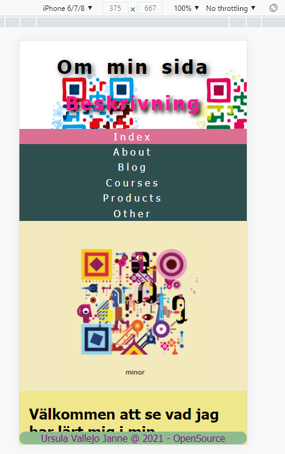
- Ipad:

  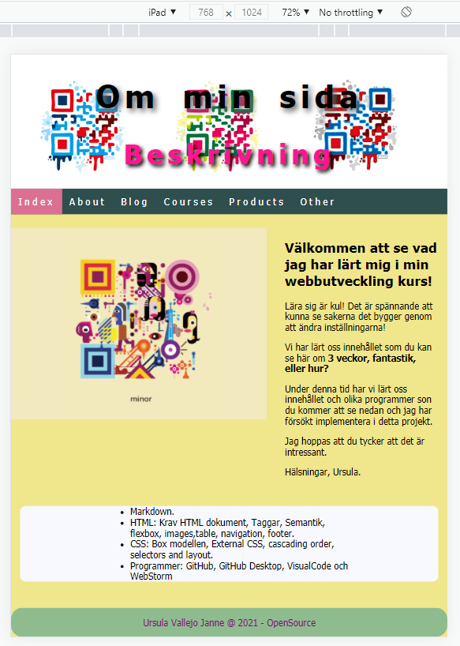
- Desktop:

  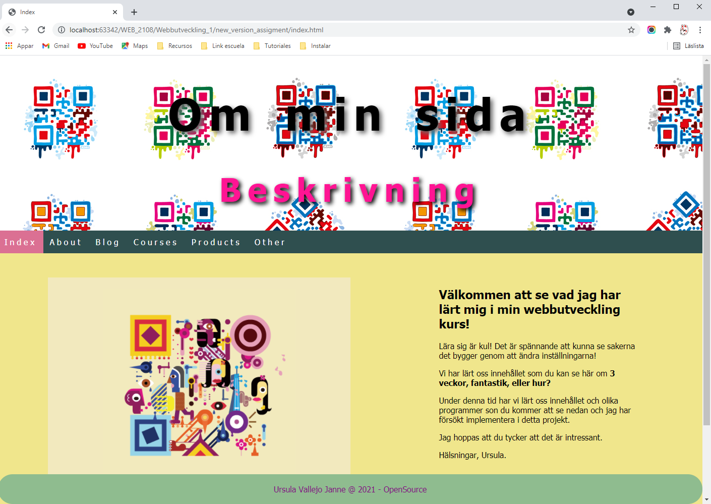

-text 4

-Text 5

-text 6

-text 7

-text 8

## Steg 4: blogg.html

-Text 1

-text 2

-På denna webbplats har jag analyserat kompatibiliteten för olika enheter : iPhone 6-7, iPad och Desktop. Samt hur de ser ut i Goggle Chrome och Microsoft Edge.
- iPhone:

  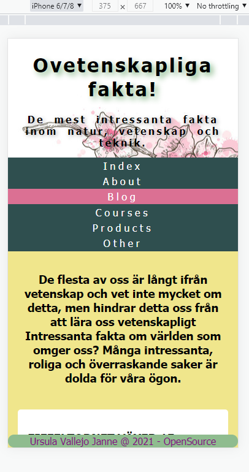
- Ipad:

  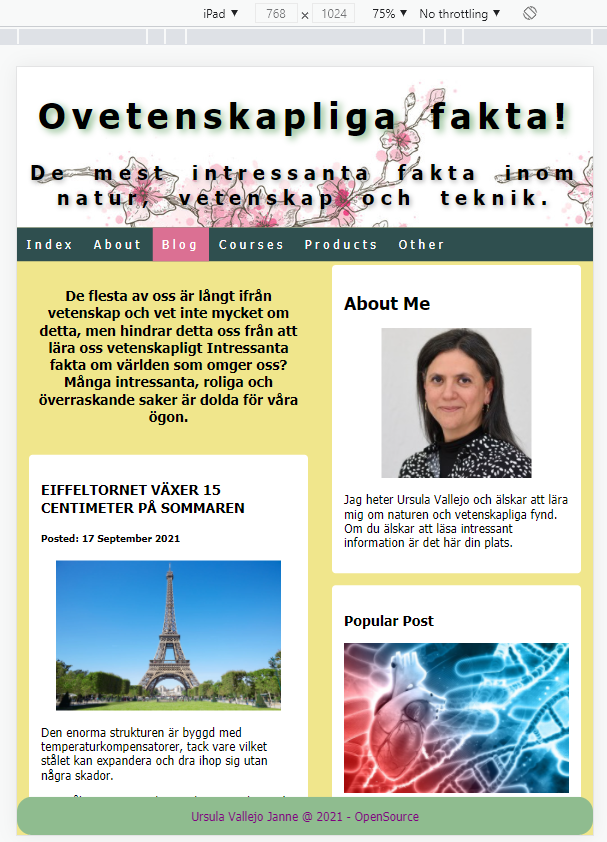
- Desktop:

  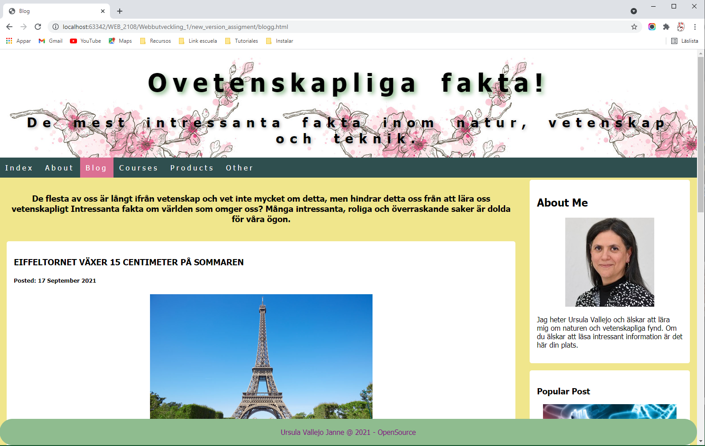

  - 
-text 4

-Text 5

-text 6

-text 7

-text 8

## Steg 5: products.html

-Text 1

-text 2

-På denna webbplats har jag analyserat kompatibiliteten för olika enheter : iPhone 6-7, iPad och Desktop. Samt hur de ser ut i Goggle Chrome och Microsoft Edge.
- iPhone:

  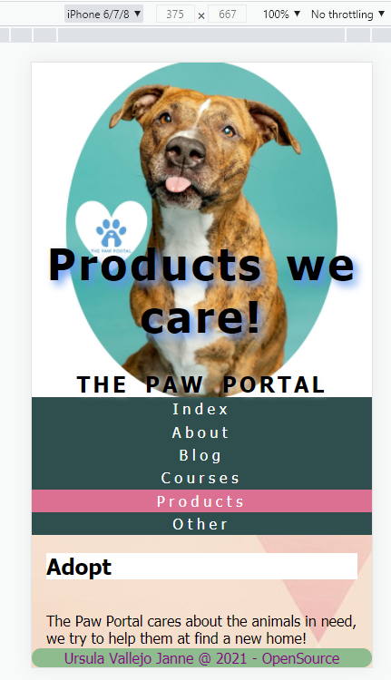
- Ipad:

  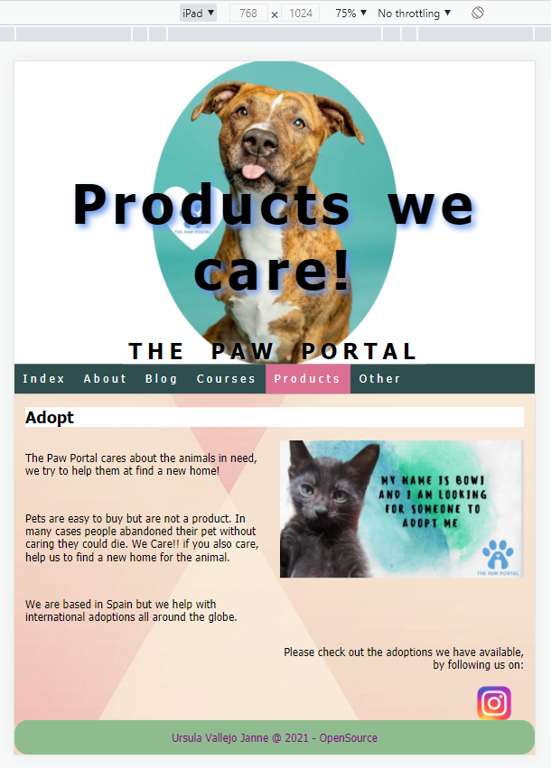
- Desktop:

  

-text 4

-Text 5

-text 6

-text 7

-text 8

## Steg 6: other.html

-Text 1

-text 2

-På denna webbplats har jag analyserat kompatibiliteten för olika enheter : iPhone 6-7, iPad och Desktop. Samt hur de ser ut i Goggle Chrome och Microsoft Edge.
- iPhone:

  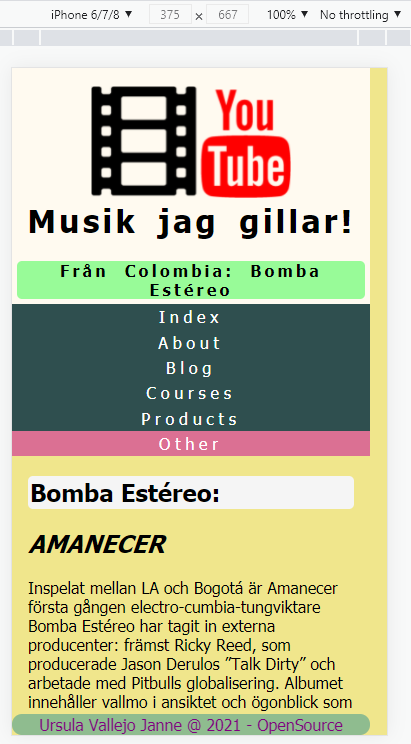
- Ipad:

  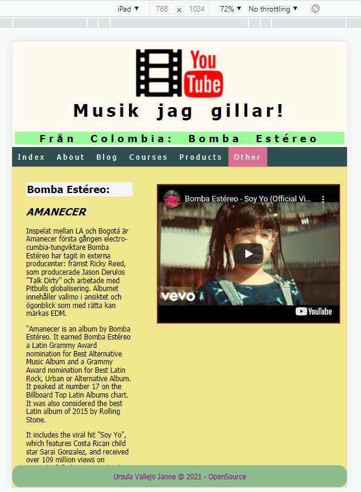
- Desktop:

  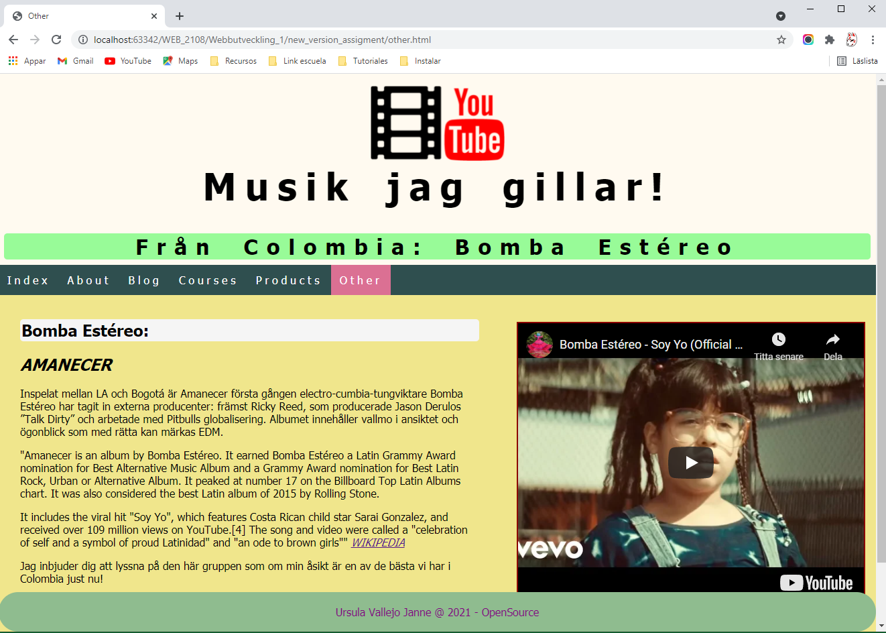

  - 
-text 4

-Text 5

-text 6

-text 7

-text 8

## Uppgifter Info
[Länk till uppgifter information](assignment.pdf)

