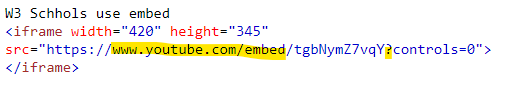

### September 2021
# Webbutveckling 1
## Projektuppgift *Ursula Vallejo Janne*
### Content Innehåller:
- [1. General Projektplan](#1-general-projektplan-)
- [2. Dokumentation](#2-dokumentation--)
  - [Steg 1: about.html](#steg-1-abouthtml)
  - [Steg 2: courses.html](#steg-2-courseshtml)
  - [Steg 3: index.html](#steg-3-indexhtml)
  - [Steg 4: blogg.html](#steg-4-blogghtml)
  - [Steg 5: products.html](#steg-5-productshtml)
  - [Steg 6: other.html](#steg-6-otherhtml)
- [3.Uppgifter Info](#3-uppgifter-info)

# 1. General Projektplan :

I kursen har vi använt Trello-programmet för att kunna följa en organiserad arbetsplan, som styr projektmålen och kvalifikationskraven.
Detta program hjälper dig att tydligt visualisera de avsnitt du arbetar med inom ett projekt.
På så sätt kan du hålla reda på vad som fungerar och vad som behöver göras. Således är man mer medveten om var projektet är och garanterar ett bättre resultat genom att inte utelämna saker på grund av glömska.
I mitt projekt kan du se en karta för varje Steg i projektet, en beskrivning av kraven i varje och de detaljer som arbetades med.
Också ett kort för varje som krävs för att få kvalifikationer.

Du kan se mitt projektplan i länken nedan:

[Trello Webbsida ](https://trello.com/invite/b/MumOFN0P/9878ada236feb82b544166f8b5eddfc0/webbutveckling1)

# 2. Dokumentation  :

Projektet består av 6 punkter som motsvarar en html -sida vardera:
- About
- Courses
- index
- blogg
- products
- other

##Layout

Det första tillvägagångssättet jag hittade var att tänka på hur man gör att projektet länkar till varandra och inte gör varje sida helt annorlunda, utan någon koppling.Det är därför jag bestämde att alla sidor skulle dela samma design: i den övre marginalen har du titeln, sedan navigeringsfältet och statisk sidfot som var alltid närvarande för att skapa den känslan av enhet.Även när jag försökte hitta en enhet mellan sidorna övervägde jag att använda bakgrundsfärger som upprepas mellan dem.

Jag föreslog en layout som upprepas i de olika sektionerna, för detta skapade jag en allmän CSS -sida, en annan som innehåller navigeringsfältet och en annan sidfot. Med sina respektive konfigurationer för att fungera på olika enheter som vi kommer att se senare i CSS -avsnittet.

###Navbar:
När jag gjorde navbar tog jag också upp en möjlig ordningsföljd mellan namnen på varje länkar. Så jag bestämde mig för att elementens ordning skulle ha en ordning så jag skrev först index, vilket är starten på projektet där du hittar en allmän beskrivning av vad projektet handlar om.
Sedan har jag lagt About som förklarar vem som gör projektet.
Det följs av bloggen som vanligtvis är information som någon har åsikter som kan vara relaterad till personen i About (gillar, intressen eller åsikter).
Sedan lägger jag länken till produkter som inte längre är så personliga utan presenterar något utanför det personliga omfånget. Och slutligen other som är kompletterande information.

##HTML Code ordning

När jag skrev min html tog jag upp en mental plan som hjälpte mig mycket. Det är att visualisera en Matryoshka, där elementen är inkapslade i varandra.
Jag såg behovet av att se det så här för att förstå en allmän struktur och hur det inom varje tagg inkapslar andra i förhållande till en semantik.

Ett fel jag upptäckte i början var att jag inkluderade i main tag, till exempel aside tag, som jag senare förstod att den inte kan inkluderas där, och inte heller har flera main tag i en kod.

För att förstå begreppet main tag bra, gå till w3 schools.

[W3Schools Webbsida: `HTML <main> Tag`](https://www.w3schools.com/tags/tag_main.asp)

##CSS Responsiv webbdesign : Kompatibilitet med olika enheter

Projektet ska kunna anpassa sig till olika enheter som: iPhone, iPad och skrivbordet.
För detta har vi använt `@media` - media queries.
Layoutkonfigurationerna har haft detta behov av att anpassa sig till olika enheter, så i varje style.CSS finns det en förändring i storlek och visualiseringskonfiguration med hjälp av `@media`.

Enhetsstorlekarna som jag har använt för den här konfigurationen är:

-iPad / Tablet:
`@media screen and (min-width: 768px)`

-Desktop:
`@media screen and (min-width: 992px)`

##CSS Style: file.css

I projektet föreslog jag att varje sida skulle ha sin egen oberoende CSS -sida så att den endast skulle innehålla de koder som gäller det projektet. 

Det finns en annan som innehåller de aspekter som upprepas sinsemellan som går separat och två andra som är specifika för footer och navbar med sina egna media queries.

##Bilder

För att konfigurera storleken på bakgrundsbilderna för de olika enheterna var jag tvungen att undersöka hur jag skulle göra det eftersom det var svårt för mig och de passade inte mig. Jag lyckades fixa det genom att läsa W3Schools -informationen om storlek, no repeat, align center among andra.

`background: url(mountain.jpg);
 background-repeat: no-repeat;
 background-size: 100% 100%;`

[Information W3 Schools:background-size ](https://www.w3schools.com/cssref/css3_pr_background-size.asp)

## Steg 1: about.html

-Den här sidan är relaterad till den första övningen vi har gjort i klassen. Det första jag gjorde är att se vilken information om detta första projekt som var relevant för det nya projektet.
Gör en plan för hur informationen ska distribueras och kunna komplettera de krav som efterfrågades i detta projekt.

-Jag bestämde mig för att informationen skulle gå före borden eftersom de fungerade som en introduktion till vem jag är.

-För bilderna på de 4 platser där en svävar lever för att markera var och en.

-För tabeller använder 3 tabeller ett wrap och inline-block för att relatera dem eftersom de har samma format och visar specifika listor med viss information.

-Använd bakgrundsbilden på rubriken eftersom jag relaterar till Japan och jag gillar körsbärsblommor mycket och här berättar jag personliga aspekter och är direkt relaterad till dessa.

-På denna webbplats har jag analyserat kompatibiliteten för olika enheter : iPhone 6-7, iPad och Desktop. Samt hur de ser ut i Goggle Chrome och Microsoft Edge.

###Så här ser de olika enheterna ut:
  - iPhone:

    
  - Ipad:

    
  - Desktop:

    

## Steg 2: courses.html

-Informationen i detta avsnitt är hämtad från Campus Mölndal webbsidan och från Skolverket:

[Webb Campus Mölndal ](https://www.molndal.se/campus-molndal.html)

[Webb Skolverket](https://www.skolverket.se/sok)

-I början av sidan ville jag lägga en sammanfattning av kursen med en länk till skolan om någon är intresserad av att söka till kursen.
Det inkluderade också en länk till csn så att de enkelt kan få tillgång till information om bidrag.

-Tabellen med kursinformation, välj att inkludera datum som varje kurs har och separera informationen för varje kurs så att det är lättare visuellt att se på olika enheter.

-Använd grafiken på campus Mölndal webbplats för att direkt relatera den till den, eftersom det är de som undervisar kursen.

-informationen för varje kurs följer samma parameter:

-På denna webbplats har jag analyserat kompatibiliteten för olika enheter : iPhone 6-7, iPad och Desktop. Samt hur de ser ut i Goggle Chrome och Microsoft Edge.

###Så här ser de olika enheterna ut:
- iPhone:

  
- Ipad:

  
- Desktop:

  

## Steg 3: index.html

-Den här sidan för mig borde kunna förklara för personen att besöket består av vad de kommer att se härnäst, förhållandet till kursen jag gör och vad vi har sett av innehållet som ingår i detta projekt.

-För att göra sidan mer visuellt attraktiv och inte så statisk bestämde jag mig för att leta efter en gif och ge vikt åt sidan av det centrala innehållet.

-Leta efter en bakgrundsbild för rubriken som var relaterad till det andra visuella elementet jag använde.

-På denna webbplats har jag analyserat kompatibiliteten för olika enheter : iPhone 6-7, iPad och Desktop. Samt hur de ser ut i Goggle Chrome och Microsoft Edge.

###Så här ser de olika enheterna ut:

- iPhone:

  
- Ipad:

  
- Desktop:

  

## Steg 4: blogg.html

-För detta avsnitt, använd w3 Schools webbplats som inspiration:

[Information W3 Schools: How TO - Blog Layout](https://www.w3schools.com/howto/howto_css_blog_layout.asp)

-Innan jag hade begreppet grid gjorde jag det med flexbox. Jag upprepade det och fann att det var lättare med rutnät att kunna lägga ut elementen inom området.

-Tänk på att eftersom det är ett informationsinlägg bör varje inlägg ha en länk till dess ursprung. För detta bestämde jag mig för att göra en hoover i varje bild och med dess länk till varje sida där informationen togs.

-Jag har skapat en kontaktsektion så att det kan bli en interaktion med personen, skriv inlägget och en länk till hennes facebook för att kunna kontakta henne också.

-I kommentarsfältet kunde jag inte utöka området där kometerna är skrivna men jag kunde lösa det med text area tag som jag hittade i w3Schools:

`<textarea name="message" rows="10" cols="30">The cat was playing in the garden.</textarea>`

[Information W3 Schools:text area ](https://www.w3schools.com/tags/tag_textarea.asp)

-På denna webbplats har jag analyserat kompatibiliteten för olika enheter : iPhone 6-7, iPad och Desktop. Samt hur de ser ut i Goggle Chrome och Microsoft Edge.

###Så här ser de olika enheterna ut:
- iPhone:

  
- Ipad:

  
- Desktop:

  

## Steg 5: products.html

-På den här sidan valde jag min ideologi att använda istället för konsumentobjekt, djur som också är en konsumentvara eftersom de är köpta. Att kunna visualisera en orsak som intresserar mig istället för produkter från ett företag.

-Jag följde parametern som gavs oss i det första diagrammet på produktsidan för att byta ut 3 block med foton på produkter och texter mellan dem.

-För att lösa flödet mellan bild och text, använd ett horisontellt grepp, som dupliceras tre gånger och ändrar konfigurationen mellan dessa interna element i var och en oberoende av varandra.

-På denna webbplats har jag analyserat kompatibiliteten för olika enheter : iPhone 6-7, iPad och Desktop. Samt hur de ser ut i Goggle Chrome och Microsoft Edge.

###Så här ser de olika enheterna ut:
- iPhone:

  
- Ipad:

  
- Desktop:

  

## Steg 6: other.html

-För att kunna göra det här avsnittet har jag varit tvungen att undersöka vad en iframe arbetade med och hur jag konfigurerade den.

Det såg ganska enkelt ut att implementera, men när jag gjorde vad det sa i min w3 Schools -referens fungerade inte videon i youtube -webbadressen.
Jag började jämföra och url -adressen från you tube inkluderade inte samma sak som de använde på w3 -webbplatsen.
Ändra formatet som används i W3 Schools så kan du fixa det.
Det var inte samma html -sökväg och använd embed:

W3 Schools: url youtube:

YouTube: url to share video:

Länkar W3 Schools information jag använd:

[`HTML <iframe> Tag`](https://www.w3schools.com/tags/tag_iframe.ASP)

[HTML YouTube Videos](https://www.w3schools.com/html/html_youtube.asp)

-För varje enhet konfigurerar jag en bokstavsändring beroende på skärmens storlek. Även storleken på videon justerades i förhållande till skärmens storlek och förhållandet till objekten på sidan.

-Två externa länkar inkluderades för att ge mer information om gruppen: wikipedia och youtube, som öppnas för en separat skärm.

- Jag fann också möjligheten att direkt exportera en iframe från You tube -webbplatsen. Tänk på att för detta projekt var det mer intressant att ta informationen för att konfigurera den manuellt som anges på W3schools -sidan.

-På denna webbplats har jag analyserat kompatibiliteten för olika enheter : iPhone 6-7, iPad och Desktop. Samt hur de ser ut i Goggle Chrome och Microsoft Edge.

###Så här ser de olika enheterna ut:

- iPhone:

  
- Ipad:

  
- Desktop:

  

## 3. Uppgifter Info

För att du ska förstå projektet, inbjuder jag dig att komma åt länken nedan där du kan se det ursprungliga projektet.

[Länk till uppgifter information](assignment.pdf)

