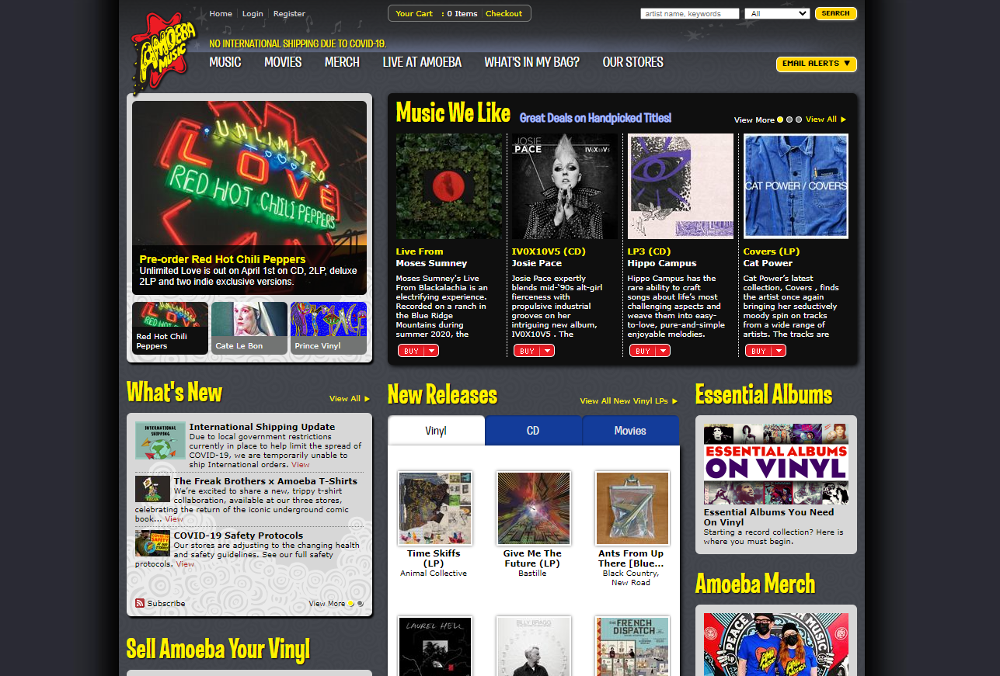

### February 2022
# Webbutveckling 2
## Projektuppgift *Ursula Vallejo Janne*
### Content Innehåller:

- [1. General Projektplan](#1-general-projektplan-)
- [2. Personas](#2-personas-)
- [3. Wireframes](#3-wireframes-mobiler-tablets-och-desktop-)
    - [A. Low Fidelity](#a-low-fidelity)
    - [B. Prototyp](#b-prototyp-)
        - [UI och UX](#ui-och-ux)
- [4. Fonts](#4-fonts-)
- [5. Färgschema](#5-frgschema-)
- [6. Dokumentation](#6-dokumentation-)
    - [ Persona Profil ](#persona-profil)
    - [ Font ](#fonts)
    - [ Color ](#fonts)
    - [ Wireframes](#wireframes)
    - [ Konklusionen](#konklusionen)


- [3.Uppgifter Info](#3-uppgifter-info)

# 1. General Projektplan :

I Web Development 2-projektet tog jag mitt tidigare projekt från klassen programmering_1 och gjorde om det i REACT.

Projektet är att göra en musikbutik där funktionerna att lägga till i varukorgen, ta bort och uppdatera data på artiklarna finns.

Jag tar som referens en webbsida i en musikbutik som är specialiserad och har en bredare aspekt av produkter som inte är typiska för mainstream.

Här kan du se originalsidan:
[AMOEBA MUSIC](https://www.amoeba.com/)

För att utveckla layouten för mitt projekt tog jag som grund logotypen som användes för att posera de olika stilarna som vi kommer att se mer detaljerat i motsvarande avsnitt.

En del av projektet är att ha en projektutvecklingsplan vars beståndsdelar är nedbrutna i Trello.

Du kan se mitt projektplan i länken nedan:

[Trello Webbsida ](https://trello.com/invite/b/rqes8n1G/f6fc2d9657cdb567d8b8453acf6bea44/webbutveckilng2)

## Installera följande npm paket i min projekt:

```shell

   npm install react-router-dom@6
   npm install react-icons
   npm install tachyons@4.12.0
   
```

<details>
<summary> # Getting Started with Create React App </summary>

This project was bootstrapped with [Create React App](https://github.com/facebook/create-react-app).

## Available Scripts

In the project directory, you can run:

### `npm start`

Runs the app in the development mode.\
Open [http://localhost:3000](http://localhost:3000) to view it in your browser.

The page will reload when you make changes.\
You may also see any lint errors in the console.

### `npm test`

Launches the test runner in the interactive watch mode.\
See the section about [running tests](https://facebook.github.io/create-react-app/docs/running-tests) for more information.

### `npm run build`

Builds the app for production to the `build` folder.\
It correctly bundles React in production mode and optimizes the build for the best performance.

The build is minified and the filenames include the hashes.\
Your app is ready to be deployed!

See the section about [deployment](https://facebook.github.io/create-react-app/docs/deployment) for more information.

### `npm run eject`

**Note: this is a one-way operation. Once you `eject`, you can't go back!**

If you aren't satisfied with the build tool and configuration choices, you can `eject` at any time. This command will remove the single build dependency from your project.

Instead, it will copy all the configuration files and the transitive dependencies (webpack, Babel, ESLint, etc) right into your project so you have full control over them. All of the commands except `eject` will still work, but they will point to the copied scripts so you can tweak them. At this point you're on your own.

You don't have to ever use `eject`. The curated feature set is suitable for small and middle deployments, and you shouldn't feel obligated to use this feature. However we understand that this tool wouldn't be useful if you couldn't customize it when you are ready for it.

## Learn More

You can learn more in the [Create React App documentation](https://facebook.github.io/create-react-app/docs/getting-started).

To learn React, check out the [React documentation](https://reactjs.org/).

### Code Splitting

This section has moved here: [https://facebook.github.io/create-react-app/docs/code-splitting](https://facebook.github.io/create-react-app/docs/code-splitting)

### Analyzing the Bundle Size

This section has moved here: [https://facebook.github.io/create-react-app/docs/analyzing-the-bundle-size](https://facebook.github.io/create-react-app/docs/analyzing-the-bundle-size)

### Making a Progressive Web App

This section has moved here: [https://facebook.github.io/create-react-app/docs/making-a-progressive-web-app](https://facebook.github.io/create-react-app/docs/making-a-progressive-web-app)

### Advanced Configuration

This section has moved here: [https://facebook.github.io/create-react-app/docs/advanced-configuration](https://facebook.github.io/create-react-app/docs/advanced-configuration)

### Deployment

This section has moved here: [https://facebook.github.io/create-react-app/docs/deployment](https://facebook.github.io/create-react-app/docs/deployment)

### `npm run build` fails to minify

This section has moved here: [https://facebook.github.io/create-react-app/docs/troubleshooting#npm-run-build-fails-to-minify](https://facebook.github.io/create-react-app/docs/troubleshooting#npm-run-build-fails-to-minify)

</details>


# 2. Personas :


För att utveckla projektet beaktas potentiella användares profiler. Jag har skapat personas från observationer om möjliga riktiga användare:

1. 

2. 

3. 


Jag har skapat 3 olika personas :


# 3. Wireframes (mobiler, tablets och desktop) :

## A. Low fidelity:

Tanken är att de olika sidorna delar samma layoutformat, och att informationen presenteras på ett tydligt och organiserat sätt.
Nedan kan vi se den första skissen på tillvägagångssättet för hemsidan för fiskeklubben:


## B. Prototyp :

Utvecklingen av Wireframes för projektet utvecklades i Figma, för vilket jag inbjuder dig att se utvecklingen av detta i följande länk:

[PROTOTYP FIGMA PROJECT ](https://www.figma.com/file/DigiQII48pqsoi3BTXHqTk/Gr%C3%A4nssnittsdesign-FiskeKlubb?node-id=0%3A1)


### UI och UX:

För att utveckla mitt UI/UX baserar jag mig på information från People och på layouten som jag har skapat utifrån stilen på logotypen de har.



- 

- När jag skapade personerna identifierade jag att det finns många användare som behöver ha snabb tillgång till alternativen för att köpa fiskekortet eller möjligheten att göra en swish, för vilket jag valde att ha två knappar på den del av hjälten som är markerade från bakgrunden för att ha dem visuellt och lättillgängliga.


- I menyn på den aktuella sidan som vi ser ovan finns 15 olika alternativ så det är inte lätt att se innehållet. Efter vad vi såg i klassen om informationsarkitektur, grupperade jag dem i 5 huvudalternativ: HEM, NYHETER, OM FISKE, REGLER och MEDLEM.
  Av dessa 5 menyer visar information relaterad till dem för att förbättra användargränssnittet.

Nedan kan vi se undermenyerna:


- På huvudsidan anses det vara relevant att ha informationen om Gråbosjöarna då de personer som kommer åt denna sida relaterar till varandra eftersom de ska besöka dessa sjöar för sin motivation och en kort introduktion av var Gråbo ligger och vad det gör Fiskeklubban. Denna aspekt som inte fanns på den tidigare hemsidan och jag anser vara viktig för att försätta användaren i en situation.

- För att få en visuell balans på webbsidan, välj att förena ikonerna för andra plattformar som t.ex. Facebook, instagram eller Swish med färgpaletten som används på webben. Också för att hitta denna visuella förening med bilder mestadels i svartvitt.

- Höjknappar som sticker ut med bakgrundsfärgen där annan information kan nås: från externa sidor eller dropdown Menu ( Button Medlem sida: Contact, styrelse eller Swisha ) med kompletterande information.

- Ha samma layout för Main, där samma struktur föreslås med en sida där de senaste nyheterna finns, ett sökfält och möjlighet att följa dem på sociala medier. Allt detta är samma schema på alla webben.
- Den enda sidan där detta varierar är Medlem där även ett kontaktformulär läggs till.

- I Footer väljer du att sätta informationen om nödtelefonnumret så att det alltid finns till hands och kontakten till fiskeklubben.

# 4. Fonts :

För att utveckla hemsidan valde jag 3 olika typer av typeface som har en markerad geometrisk bas som överensstämmer med den befintliga klubbens logotyp. Detta förklarar jag mer i detalj i dokumentationsdelen.

Typeface jag valde var följande:

1. Oswald
2. Montserrat
3. SourceSansPro

När mitt urval gjordes efter researchprocessen testade jag dem på webblasaren för att se om de verkligen fungerade bra tillsammans. Vilket du kan se nedan:


##Final Fonts , sizes and color:


# 5. Färgschema :

Klubben har redan en logotyp som de använde och är nöjda med den. De vill behålla som möjligt vissa färger kan matcha vad de brukar använda: orange, grått, svart och vitt.

Se nedan logotypen de har och någon broschyr de gör för evenemang:


## Color Style:

Jag har tagit idé att klubben är min klient och behöver anpassa sig och försöka tillgodose vad kunden frågar, eftersom de har klart vill behålla samma logotyp.  Under den förutsättningen måste rymma en rad färger som kan fungera med de som de använde (orange och grå).

##Final Color Palette:


# 6. Dokumentation :

Därefter berättar jag om processen som jag har haft för att utveckla de olika aspekterna av projektet.

Den är uppdelad efter de olika ämnen som är relaterade till uppgiften.

## PERSONA PROFIL

För att kunna skapa Personas-profilen var mitt första steg att läsa några artiklar för att kunna förstå vilken information som verkligen behövdes och syftet att skapa en persona för UX-designen.

10-steget för att skapa en persona profil hjälper mig verkligen att förstå och se vilken inverkan det har på UX-designen (Interaction Design Foundation). Ha olika aspekter av användaren i åtanke och de olika scenarierna innan vi startar vårt projekt är verkligen viktigt eftersom det påverkar vad vi vill överföra och att kunna fokusera på målet och syftet med webbsidan vi skapar. Se nedan de olika steg som rekommenderas att följa:


För att skapa a template Layout för personas-profilen använde jag programmet _Draw.io_ som du kan se nedan:


- [Draw.io](https://app.diagrams.net/)

Länkar till artiklarna:

- [Piet Alberts: How to create user personas in UX design](https://pietalberts.com/create-personas-ux-design/#:~:text=The%20main%20reason%20behind%20creating%20Personas%20in%20UX,your%20team%20can%20make%20more%20confident%20design%20decisions.)

- [Interaction Design Foundation: Personas – A Simple Introduction ](https://www.interaction-design.org/literature/article/personas-why-and-how-you-should-use-them)

- [Adobe XD Ideas:Putting Personas to Work in UX Design ](https://xd.adobe.com/ideas/process/user-research/putting-personas-to-work-in-ux-design/)

##  FONTS

Innan jag valde vilken typ som ska användas i projektet har jag tagit hänsyn till att man redan användes i klubbens logotyp.  Detta är geometriskt och rent (sans).

Jag började undersöka hur man använder olika typsnitt i ett projekt och det rekommenderades att använda högst 3, och ha olika aspekter av brevets storlek och stil när jag väljer vilken som ska användas för att arbeta tillsammans.

I vissa artiklar har jag läst rekommenderade verktyg som Cava och Type-scale för att bättre kunna visualisera typen av bokstäver, deras storlekar och ta idé om Type-face som kan fungera tillsammans.

På Cava-sidan har jag tagit som inspirationsteckensnitt som kan fungera bra tillsammans. Att ta som grund för att de var lätta att läsa, med en stark geometrisk bas för att arbeta med logotypen och ta hänsyn till att de flesta användare kommer in på webben är för en mer praktisk funktion. De flesta användare har en mer maskulin profil som är i linje med ett mindre utsmyckat och lättare typsnitt.

Det här var de idéerna om type-face som kan fungera tillsammans som fungerade som utgångspunkt för mig:


Type-scape fungerade som ett verktyg för att se hur olika typer av type-face fungerade tillsammans, som fanns i google-fonts och de olika storleksskalorna. Det ansågs också att bokstäverna i det svenska alfabetet inkluderades.

Nedan kan vi se de tre olika typerna av type-face som jag väljer använd i projekten:

__* Oswald :__


__* Montserrat :__


__* Source Sans Pro :__


Detta verktyg ger oss möjlighet att se hur två typer av typ-ansikte fungerar samtidigt. Vilket är mycket användbart.

Nedan kan vi se hur Oswald arbetar med Montserrat:


Nedan kan vi se hur Montserrat arbetar med Source Sans Pro:


Länkar :
- [Type-Scale](https://type-scale.com/)

- [Canva: Typography guide ](https://www.canva.com/learn/typography-guide/)

- [Canva: Font pairing ](https://www.canva.com/learn/the-ultimate-guide-to-font-pairing/)

- [MIZKO: Create a RESPONSIVE Typography Scale for Mobile & Tablet](https://www.youtube.com/watch?v=LYCt_AOJRss)

## COLOR

För att skapa färgpaletten som jag äntligen kommer att använda i projektet, undersök de olika aspekterna av paletten baserat på orange och grått. I logotypen dominerar orange så undersök olika egenskaper för att se vilka typer av varianter jag kan använda.

Nedan kan du se de olika aspekterna som beaktas i processen att skapa paletten att använda:


Palette generated by Material Palette - materialpalette.com/blue-grey/deep-orange:
```
.dark-primary-color    { background: #455A64; }
.default-primary-color { background: #607D8B; }
.light-primary-color   { background: #CFD8DC; }
.text-primary-color    { color: #FFFFFF; }
.accent-color          { background: #FF5722; }
.primary-text-color    { color: #212121; }
.secondary-text-color  { color: #757575; }
.divider-color         { border-color: #BDBDBD; }
```
Adobe Color-wheel : Monokrom för färger #FF5722


Adobe Color-wheel : Nyanser för färger #FF5722


De verktyg som användes i denna forskning var:

- [Adobe Color-Wheel ](https://color.adobe.com/sv/create/color-wheel)

- [Material design palette ](https://www.materialpalette.com/)

##  WIREFRAMES

I avsnittet UX / UI som vi såg tidigare kan vi hitta användbar information för att förstå de beslut som togs.

I det här avsnittet visar jag ett exempel på manipulation av logotyper för att förena dem med designen:


Vi kan även nedan se de olika källorna som jag besöker för att få idéer om hur man gör designen.
Några idéer att tittade på för navigeringsmenyn:

- [CodePen](https://codepen.io/karimbalaa/pen/WboBBY/
  navbar)
- [W3 Schools](https://www.w3schools.com/css/css_navbar_horizontal.asp)

Några idéer att tittade på för Layout:
- [CodePen](https://codepen.io/celincky/details/zdqso)
- [Free Frontend](https://freefrontend.com/css-menu/)

För Hero:
- [W3 Schools](https://www.w3schools.com/howto/howto_css_hero_image.asp)


Letar efter idéer om ämnet fiske för att se om jag skulle implementera dem, men jag bestämde mig för att inte göra det eftersom de grafiskt sett är vackra men de hade inte ett konsekvent förhållande till bilden jag letade efter på webbplatsen för fiskeklubben.
- [Code Pen](https://codepen.io/jomohop/pen/BEwywr)
- [Code Pen](https://codepen.io/thebabydino/pen/rNzRQWq)
- [Code Pen](https://codepen.io/loganliffick/pen/ZEXKqyv)

## Konklusionen

Jag anser att det är ett mycket användbart verktyg att överväga vem som ska använda vår produkt innan man gör den för att kunna bli mer framgångsrik när man överväger en design.

I mitt fall frågar jag mig själv en fiktiv klient; Fiskeklubben hjälpte mig att försätta mig i en verklig situation där jag hade en referensram för att optimera en redan befintlig information (klubbens hemsida).

I den första fasen var det nyttigt att analysera de olika personerna som kunde komma åt hemsidan, till detta kommer att jag även har kunnat gå för att se sidan i verkligheten och hur allt är organiserat.

I en andra fas för att se hur de hade lyft sin webbplats och vilket innehåll som var relevant för min förmodade kund. Därifrån kunde jag dra värdefulla slutsatser för att överväga projektsidans UI.

En av svårigheterna som jag hade när jag gjorde wireframes är att jag vid vissa tillfällen frågade konstruktioner som med den kunskap jag har för närvarande om kursen och den tid vi fick för att utveckla projektet var det inte lätt att utveckla så jag kasserade dem.
Jag kunde till exempel ha gjort ett intro till Hero som animerade logotypen och texten som jag gick till CodePens hemsida för idéer, men tackade nej eftersom jag tyckte det var svårt att implementera med den grund jag har för närvarande.

I utvecklingsdelen av webben var det vid flera tillfällen svårt för mig att organisera elementen i den stil jag letade efter. Förstå hur de olika display (block, inline och float) fungerar och samt göra Labels och input responsiva i CC.

Jag försökte göra navBar Menu i JS men jag hittade svårigheten att när jag ville använda alternativet att när en del av menyn är aktiverad hålls bokstaven i en färg (som visar att den finns i det innehållet) med alternativet aktiv men jag var tvungen att kassera den eftersom jag inte kunde utveckla den i JS så jag skickade den till HTML och jag kunde aktivera den med CSS.

Att utföra detta arbete hjälpte mig att se hur ett projekt kan struktureras med hänsyn till UI, fräscha upp kunskapen som vi hade från tidigare lektioner men framför allt när jag har svårt att tänka hur de kan lösas genom att söka information eller fråga i forum.

Jag tror att det finns saker som skulle kunna utvecklas bättre på utvecklingsnivå, men med nuvarande kunskap försökte jag göra så gott jag kunde.

# 3. Uppgifter Info


problems:

test:
Test Suites: 0 of 1 total
Tests:       1 failed, 1 total
● renders learn react link

    TypeError: productOnCartCtx.itemIsOnCart is not a function

       6 |     const productOnCartCtx = useContext(StoreContext);
       7 |
    >  8 |     const itemIsOnCart = productOnCartCtx.itemIsOnCart(props.id);
         |                                           ^
       9 |
      10 |  function addNewProductToCartHandler(){
      11 |      itemIsOnCart.addProduct({

      at CardItem (src/components/card/CardItem.jsx:8:43)
      at renderWithHooks (node_modules/react-dom/cjs/react-dom.development.js:14985:18)
      at mountIndeterminateComponent (node_modules/react-dom/cjs/react-dom.development.js:17811:13)
      at beginWork (node_modules/react-dom/cjs/react-dom.development.js:19049:16)
      at HTMLUnknownElement.callCallback (node_modules/react-dom/cjs/react-dom.development.js:3945:14)
      at HTMLUnknownElement.callTheUserObjectsOperation (node_modules/jsdom/lib/jsdom/living/generated/EventListener.js:26:30)
      at innerInvokeEventListeners (node_modules/jsdom/lib/jsdom/living/events/EventTarget-impl.js:338:25)
      at invokeEventListeners (node_modules/jsdom/lib/jsdom/living/events/EventTarget-impl.js:274:3)
      at HTMLUnknownElementImpl._dispatch (node_modules/jsdom/lib/jsdom/living/events/EventTarget-impl.js:221:9)
      at HTMLUnknownElementImpl.dispatchEvent (node_modules/jsdom/lib/jsdom/living/events/EventTarget-impl.js:94:17)
      at HTMLUnknownElement.dispatchEvent (node_modules/jsdom/lib/jsdom/living/generated/EventTarget.js:231:34)
      at Object.invokeGuardedCallbackDev (node_modules/react-dom/cjs/react-dom.development.js:3994:16)
      at invokeGuardedCallback (node_modules/react-dom/cjs/react-dom.development.js:4056:31)
      at beginWork$1 (node_modules/react-dom/cjs/react-dom.development.js:23964:7)
      at performUnitOfWork (node_modules/react-dom/cjs/react-dom.development.js:22779:12)
      at workLoopSync (node_modules/react-dom/cjs/react-dom.development.js:22707:5)
      at renderRootSync (node_modules/react-dom/cjs/react-dom.development.js:22670:7)
      at performSyncWorkOnRoot (node_modules/react-dom/cjs/react-dom.development.js:22293:18)
      at scheduleUpdateOnFiber (node_modules/react-dom/cjs/react-dom.development.js:21881:7)
      at updateContainer (node_modules/react-dom/cjs/react-dom.development.js:25482:3)
      at node_modules/react-dom/cjs/react-dom.development.js:26021:7
      at unbatchedUpdates (node_modules/react-dom/cjs/react-dom.development.js:22431:12)
      at legacyRenderSubtreeIntoContainer (node_modules/react-dom/cjs/react-dom.development.js:26020:5)
      at Object.render (node_modules/react-dom/cjs/react-dom.development.js:26103:10)
      at node_modules/@testing-library/react/dist/pure.js:101:25
      at batchedUpdates$1 (node_modules/react-dom/cjs/react-dom.development.js:22380:12)
      at act (node_modules/react-dom/cjs/react-dom-test-utils.development.js:1042:14)
      at render (node_modules/@testing-library/react/dist/pure.js:97:26)
      at Object.<anonymous> (src/App.test.js:5:3)

----------------------------------------------------
*
Uncaught TypeError: this.props.data.map is not a function
https://stackoverflow.com/questions/30142361/react-js-uncaught-typeerror-this-props-data-map-is-not-a-function

*Failed form propType: You provided a `value` prop to a form field without an `onChange` handler

https://stackoverflow.com/questions/43556212/failed-form-proptype-you-provided-a-value-prop-to-a-form-field-without-an-on

